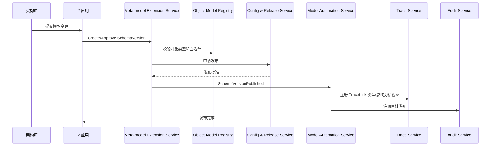
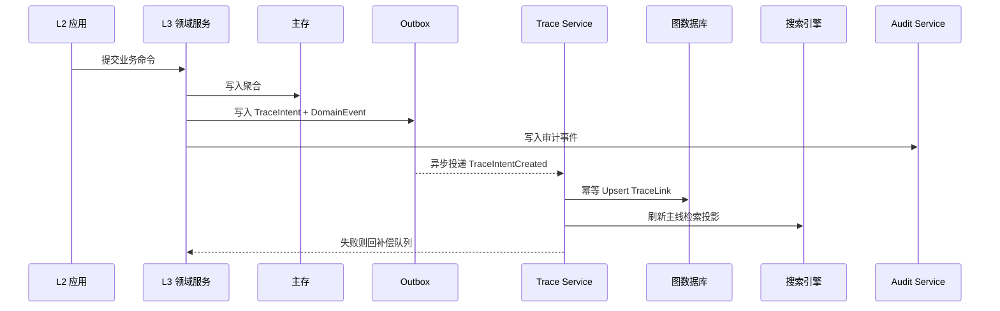
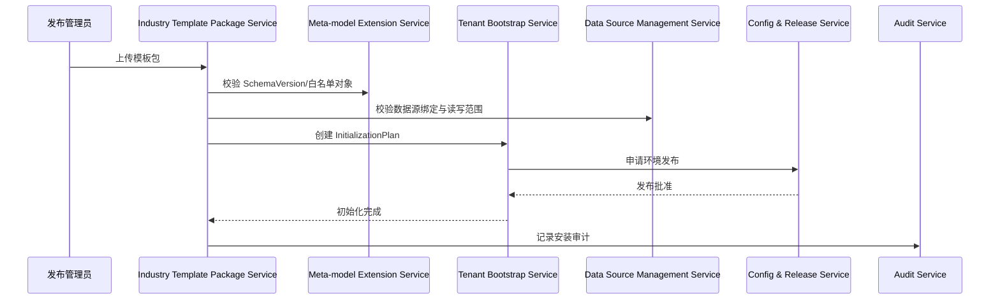

# 工业研发底座运行时契约附录

状态：`Draft v0.5`  
日期：`2026-03-11`  
对应修订项：`M-01`、`M-02`

---

## 1. 契约原则

1. 横切平面不是口号，必须具备固定接入点和回调点。
2. 业务服务只写业务事实，不直接维护图谱、搜索和审计投影。
3. 模型发布、模板安装、导出和跨网交换必须进入统一控制链。
4. 安全控制优先于业务执行，审计不晚于事务提交完成。

---

## 2. 质量属性场景明细

| ID | 触发场景 | 约束 | 目标值 | 架构策略 | 验证方式 |
| --- | --- | --- | --- | --- | --- |
| QA-01 | 用户在中心站点发起读请求 | 已登录、非导出、命中单域对象 | `P95 < 800ms` | 网关鉴权、ACL/密级缓存、读投影优先 | 压测 + 访问日志 |
| QA-02 | 用户发起业务写请求 | 单聚合事务 | `P95 < 1.5s`，零丢审计 | 主表事务 + Outbox | 压测 + 审计对账 |
| QA-03 | 业务变更触发主线更新 | 涉及跨聚合关系 | `30s` 内图谱和搜索收敛 | `TraceIntent -> Trace Service -> Graph/Search` | Trace backlog 监控 |
| QA-04 | 边缘站点连续断网 | 中心不可用，站点持续采集 | `72h` 不丢采集批次 | 边缘本地缓存 + 分片同步 | 弱网演练 |
| QA-05 | 模板包升级失败 | 升级已执行部分步骤 | `15min` 内回滚 | 版本账本 + Saga 补偿 | 发布演练 |
| QA-06 | 涉密导出请求 | 对象密级高于用户授权 | 100% 阻断并留痕 | 前置审批凭据检查 | 安全用例 |
| QA-07 | 逻辑隔离模式查询 | 多租户共享基础设施 | 零跨租户串扰 | 租户标签下推到主存/索引/图谱 | 隔离测试 |
| QA-08 | HPC 作业失败或丢回调 | 长任务、外部调度器 | 结果和状态可恢复 | `SimulationTask/HPCJob` 双对象 + 人工接管 | 演练 + 对账 |

---

## 3. 四平面 x 七层接入矩阵

| 层级 | A 模型与标准语义平面 | B 数字主线平面 | C 复制交付平面 | D 安全与保密治理平面 |
| --- | --- | --- | --- | --- |
| `L1 体验与装配层` | 渲染表单、视图、字段约束；只读使用 `SchemaVersion` | 透传 `traceContext`，不直接写 `TraceLink` | 装配页面、角色主页、模板变量渲染 | 前端能力遮罩、会话态、导出按钮控制 |
| `L2 场景应用层` | 发起对象校验、标准语义选择、模型引用 | 对业务命令附带 `traceContext` | 触发模板装载、初始化和版本切换 | 路由守卫、动作守卫、租户隔离校验 |
| `L3 领域服务层` | 创建/变更聚合前执行模式校验和引用校验 | 提交业务事实与 `TraceIntent`；不直接写图库 | 消费模板装载后的模型和配置 | 执行前调用 ACL/密级/导出策略判定 |
| `L4 平台共享服务层` | 注册模型、维护 `SchemaVersion`、发布自动联动 | `Trace Service` 负责归一化、去重、补偿、影响分析 | 模板包校验、租户初始化、发布/回滚 | 认证、授权、密级、解密和审计统一编排 |
| `L5 数据与智能层` | 依据 `PersistenceProfile` 决定主存与投影存储 | 图谱、搜索、知识索引作为投影承载 | 记录模板安装账本、版本账本和兼容性记录 | 加密、标签、防篡改、WORM 和日志留存 |
| `L6 集成与边缘层` | 连接器和标准交换代理按模型描述映射外部数据 | API/Event/File 透传 `traceContext` | 数据源绑定、站点初始化、环境变量注入 | 网关 TLS、边缘鉴权、跨网控制、传输审计 |
| `L7 治理与运行层` | 模型治理、标准语义审批和发布门禁 | 监控 Trace backlog、补偿队列和主线质量 | 升级审批、兼容性裁决和回滚授权 | 三员分立、保密合规、密钥治理和例外发布 |

---

## 4. 固定回调点

| 触发点 | 事件/回调 | 责任方 |
| --- | --- | --- |
| `SchemaVersion` 发布成功 | `SchemaVersionPublished` | `Meta-model Extension Service` |
| 聚合创建/变更提交成功 | `AggregateChanged` + `TraceIntentCreated` | 各 `L3` 领域服务 |
| 模板包安装完成 | `TemplatePackageInstalled` | `Industry Template Package Service` |
| 导出审批通过 | `ExportPermitGranted` | `Classification & Secrecy Policy Service` |
| 边缘同步批次完成 | `EdgeSyncBatchCommitted` | `Edge Sync Service` |
| `HPCJob` 回调到达 | `HPCJobUpdated` | `HPC Job Proxy Service` |

---

## 5. 时序一：模型发布与自动联动

---

## 6. 时序二：业务变更到 TraceLink 投影

---

## 7. 时序三：模板包安装与租户初始化

---

## 8. 失败处理原则

- 模型发布失败：以 `SchemaVersion` 为粒度回滚，禁止半发布状态进入运行时
- 主线投影失败：不回滚业务主事务，进入补偿队列；若超阈值则阻断相关基线冻结和发布
- 模板安装失败：以 `InitializationPlan` 为边界执行 Saga 补偿，恢复模板、数据源和注册状态
- 边缘同步失败：以批次和站点为边界重放，不允许全局重放覆盖人工修正记录
