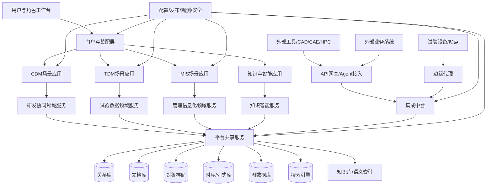
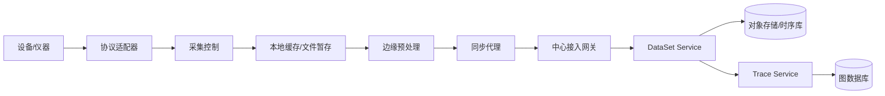

# 工业研发底座技术架构蓝图

状态：`Draft v0.3`  
日期：`2026-03-08`  
用途：基于前置研究、架构草案、统一能力地图、统一对象模型和 ADR 决策清单，给出底座的逻辑分层、服务边界、部署分区、数据架构、集成拓扑与边缘架构参考蓝图。

---

## 1. 蓝图目标

本蓝图主要回答七个问题：

1. 底座整体应如何分层。
2. 哪些服务应进入共享平台，哪些保留在领域层。
3. 数据、文件、图谱、时序、搜索应如何分工。
4. 外部系统、设备、工具与边缘站点如何接入。
5. 安全、保密、审计、运维如何贯穿整个技术架构。
6. 现有 `CDM / TDM / MIS / OLTran` 资产如何逐步演进到统一底座。
7. 平台如何从“架构底座”演进成“可复制交付的产品化引擎”。

---

## 2. 架构驱动因素

## 2.1 业务驱动

- 同时支撑 `协同研发`、`数字化试验`、`管理信息化`
- 打通 `需求 -> 项目 -> 工作包 -> 任务 -> 数据 -> 知识 -> 管理`
- 支撑多站点试验接入、跨网传输和虚实融合
- 支撑多产品线复用和差异化交付
- 支撑行业模板包驱动的快速复制交付

## 2.2 技术驱动

- 现有资产已经具备微服务、多引擎、混合存储和高可用部署基础
- 平台必须兼容国产化环境
- 平台必须同时面向中心应用与边缘站点
- 低/无代码能力需要受控纳入，而不是另起一套平台

## 2.3 约束条件

- 当前没有正式 PRD，这是一版研究驱动型蓝图
- 不能假设所有旧系统可以一次性替换
- 不能以单一数据库或单一产品统一承载全部能力

---

## 3. 总体技术策略

## 3.1 推荐总体形态

建议采用：

- `产品族共用平台内核`
- `领域服务 + 平台共享服务 + 集成中台 + 数据底座 + 边缘接入`
- 中心侧 `微服务/模块化单体混合演进`
- 边缘侧 `代理化 + 缓存化 + 异步同步`
- `受控装配层 + 元模型驱动扩展体系`
- `复制引擎 = ITP + SchemaVersion + 租户初始化 + 发布后自动联动`
- `单实例 / 逻辑隔离 / 物理隔离` 三态部署策略
- `侧挂增强 + 受控 AI Worker` 双层智能策略

## 3.2 不建议的形态

- 不做单一超级业务产品
- 不做纯流程平台
- 不做纯数据中台
- 不做通用低代码优先的平台

---

## 4. 逻辑架构蓝图

## 4.1 七层逻辑分层

| 层级              | 说明                         | 主要能力                                                                           |
| ----------------- | ---------------------------- | ---------------------------------------------------------------------------------- |
| L1 体验与装配层   | 统一入口和场景装配           | 门户、工作台、表单、视图、看板、导航                                               |
| L2 场景应用层     | 面向用户的业务应用           | CDM 应用、TDM 应用、MIS 应用、知识应用                                             |
| L3 领域服务层     | 承载领域语义和核心聚合根     | 需求、项目、工作包、任务、试验、数据集、合同、设备、知识                           |
| L4 平台共享服务层 | 承载共享内核能力             | 身份、主数据、对象模型、元模型扩展、文件、流程、任务、规则、搜索、审计、Worker执行 |
| L5 数据与智能层   | 承载多模数据和知识能力       | 关系库、文档库、对象存储、图谱、时序、搜索、知识库                                 |
| L6 集成与边缘层   | 承载外部系统、工具和设备接入 | API 网关、事件总线、文件交换、连接器、协议适配、HPC 代理、边缘代理                 |
| L7 治理与运行层   | 承载运行治理与非功能保障     | 配置、发布、观测、安全、租户隔离、国产化、资产运营                                 |

## 4.2 逻辑蓝图总图

---

## 5. 服务蓝图

## 5.1 平台共享服务

建议优先沉淀以下共享服务：

| 服务                              | 说明                                                 | 优先级 |
| --------------------------------- | ---------------------------------------------------- | ------ |
| Identity Service                  | 身份、SSO、角色、项目角色、组织映射                  | `P0`   |
| Master Data Service               | 组织、岗位、字典、编码、参照数据                     | `P0`   |
| Object Model Registry             | 对象模型、扩展模型、对象类型注册                     | `P0`   |
| File/Object Service               | 文件、对象元数据、版本、归档、快照                   | `P0`   |
| Workflow Service                  | 审批流、流程模板、流程实例                           | `P0`   |
| Task Orchestration Service        | 任务、待办、通知、状态流转、动作项                   | `P0`   |
| Meta-model Extension Service      | 对象派生、模型版本、审批、发布、回滚                 | `P0`   |
| Industry Template Package Service | ITP 解析、依赖校验、包加载、差量升级、租户初始化     | `P0`   |
| Rule Service                      | 规则、校验、触发、策略判断                           | `P1`   |
| Search Service                    | 全文、条件、标签、黄页                               | `P0`   |
| Trace Service                     | 数字主线、谱系、影响分析                             | `P0`   |
| Audit Service                     | 对象、访问、发布、导出、配置审计                     | `P0`   |
| Integration Gateway Service       | API、事件、文件、连接器治理                          | `P0`   |
| Config & Release Service          | 配置中心、环境参数、发布包、灰度                     | `P0`   |
| Model Automation Service          | 模型发布后的索引、权限点、审计类别、基础视图自动注册 | `P1`   |
| Worker Executor Service           | 规则任务、脚本任务、AI Worker 节点执行控制           | `P1`   |

## 5.2 研发协同领域服务

| 服务                       | 核心对象                     |
| -------------------------- | ---------------------------- |
| Requirement Service        | Requirement、RequirementItem |
| Project Service            | Project、Plan                |
| WorkPackage Service        | WBSNode、WorkPackage         |
| Task Collaboration Service | Task、ActionItem             |
| Review & Change Service    | Review、ChangeRequest        |
| Deliverable Service        | Deliverable                  |

## 5.3 试验数据领域服务

| 服务                   | 核心对象                                    |
| ---------------------- | ------------------------------------------- |
| Test Planning Service  | TestPlan、TestSpec                          |
| Test Execution Service | Test、MeasurementSchema、MeasurementChannel |
| DataSet Service        | DataSet、MeasurementSeries                  |
| Analysis Service       | AnalysisJob、AnalysisResult、TestReport     |
| Site & Device Service  | Site、Device                                |
| Edge Sync Service      | 边缘缓存、同步任务、断点续传状态            |

## 5.4 仿真与算力协同服务

| 服务                    | 核心对象                       |
| ----------------------- | ------------------------------ |
| Simulation Task Service | SimulationTask、TestSpec       |
| HPC Job Proxy Service   | HPCJob、ComputeQueue           |
| Result Package Service  | ResultPackage、ResultArtifact  |
| Storage Tiering Service | 热/温/冷分层迁移策略、只读映射 |

## 5.5 管理信息化领域服务

| 服务                     | 核心对象                                                |
| ------------------------ | ------------------------------------------------------- |
| Annual Plan Service      | AnnualPlan                                              |
| Research Project Service | ResearchProject                                         |
| Contract Service         | Contract、PaymentRecord                                 |
| Equipment Asset Service  | EquipmentAsset、BorrowRecord、RepairRecord、ScrapRecord |
| Approval Service         | ApprovalCase                                            |

## 5.6 知识与智能服务

| 服务                       | 核心对象                                        |
| -------------------------- | ----------------------------------------------- |
| Knowledge Service          | KnowledgeAsset、StandardItem                    |
| Taxonomy Service           | TaxonomyNode                                    |
| Semantic Retrieval Service | SemanticIndex                                   |
| AI Assistant Service       | PromptTemplate、问答与建议结果                  |
| AI Worker Executor Service | AIWorkerTask、PromptVersion、KnowledgeSourceRef |

## 5.7 装配与配置服务

装配层不另起一套业务平台，而是基于共享服务做可控装配：

| 服务                             | 说明                                         |
| -------------------------------- | -------------------------------------------- |
| View Template Service            | 页面、表单、列表、详情模板                   |
| Dashboard Service                | 看板、驾驶舱、工作台编排                     |
| Workflow Template Service        | 审批流、任务流模板                           |
| Light Integration Orchestration  | 轻量 API/事件/文件编排                       |
| Industry Template Package Loader | 行业模板包装载、变量注入、依赖校验、环境适配 |
| Tenant Bootstrap Service         | 租户、项目或站点的标准初始化流程             |

---

## 6. 数据架构蓝图

## 6.1 数据分层

建议把数据分为五层：

1. **主数据层**
   - 组织、人员、岗位、字典、编码、参照数据

2. **业务对象层**
   - 需求、项目、工作包、任务、试验、合同、设备、知识等核心对象

3. **数据资产层**
   - 文件、报告、模型、测量数据、分析结果、数据集

4. **关系与谱系层**
   - 主线、关系、影响、验证、知识网络

5. **分析与检索层**
   - 搜索索引、聚合视图、知识索引、报表快照

## 6.2 存储矩阵

| 存储能力      | 适用对象                             |
| ------------- | ------------------------------------ |
| 关系型数据库  | 主数据、项目、合同、审批、权限       |
| 文档数据库    | 柔性对象、扩展属性、配置对象         |
| 对象存储      | 文件、报告、模型、采集原始包         |
| 时序/列式存储 | 测量序列、采集数据、监测数据         |
| 图数据库      | TraceLink、知识图谱、主线关系        |
| 搜索引擎      | 全文、标签、条件组合、语义召回前置层 |

推荐补充三类持久化实现策略：

- 核心对象：`关系主表 + 扩展表/JSON 扩展字段`
- 柔性领域对象：`JSON 字段 + 文档模型 + 搜索索引`
- 超大文件与结果包：`对象存储/分布式文件系统 + 对象元数据引用`

## 6.3 关键数据关系

- 核心对象元数据不直接散落在文件系统中，必须回到对象服务统一管理。
- 大文件与时序数据不强行进入关系库。
- `TraceLink` 和知识网络不落在普通业务表附属字段中。

## 6.4 主数据与对象注册

建议设置两个中心：

- **主数据中心**
  - 管理组织、岗位、用户、字典、编码、分类

- **对象注册中心**
  - 管理对象类型、扩展模型、字段定义、状态机、白名单扩展策略
  - 管理 `SchemaVersion`、持久化策略和自动联动注册入口

## 6.5 元模型驱动扩展架构

建议把元模型驱动扩展体系分成七个子能力：

- 模型注册
- 模型派生
- 模型审批
- 模型发布与回滚
- 模型存储映射
- 模型变更事件
- 模型自动联动注册

约束原则：

- 核心对象不允许被直接重定义
- 柔性领域对象允许在白名单下派生
- 模型变更必须进入版本、审计和发布链路
- `TestSpec / MeasurementSchema` 等对象作为首批重点支持对象
- `Phase 1` 先做发布后的自动联动注册，不承诺一步到位自动生成完整 API
- `Phase 2` 再进入受控的模型驱动 API 和基础视图生成

## 6.6 复制引擎与模板包运行机制

建议把快速复制交付能力显性化为 `复制引擎`，最小闭环包括：

1. `Industry Template Package Service` 解析 `manifest.yaml`
2. `Meta-model Extension Service` 完成模型校验与 `SchemaVersion` 对比
3. `Tenant Bootstrap Service` 完成租户、项目、主数据和模板初始化
4. `Model Automation Service` 自动注册权限点、审计类别、搜索索引和基础视图
5. `Config & Release Service` 负责环境发布、回滚和差量升级

核心要求：

- 模板包加载必须有环境变量注入与密级检查
- 模板包升级必须保留客户差量，并进入受控升级链路
- 模板包清单必须预留插件挂载点，为 Phase 3 生态开放做准备

## 6.7 仿真结果分层策略

针对 CAE/SPDM/HPC 场景，建议对结果文件采用：

- 热层：近期任务结果，便于快速回看与二次分析
- 温层：阶段性结果包，支持项目复盘和评审
- 冷层：长期归档结果，按对象存储或只读映射管理

大规模网格文件、求解结果和中间文件应与业务元数据分离治理。

---

## 7. 集成架构蓝图

## 7.1 四类集成面

| 集成面         | 适用场景                               |
| -------------- | -------------------------------------- |
| API            | 业务对象服务调用、同步查询、事务请求   |
| Event          | 异步通知、状态变化、索引刷新、主线更新 |
| File           | 批量数据、模型包、报告、原始文件交换   |
| Agent/Protocol | 外部工具、本地脚本、设备协议、边缘采集 |

## 7.2 连接器治理

建议建立统一连接器目录，连接器分四类：

- IT 系统连接器
- 工具连接器
- 文件交换连接器
- OT/设备协议连接器

每个连接器至少登记：

- 连接器名称
- 类型
- 归属系统
- 认证方式
- 数据方向
- 审计等级
- 运行位置
- 责任团队

## 7.3 集成策略

- 同步调用优先使用 API
- 异步联动优先使用 Event
- 大文件优先使用 File 通道
- 本地执行与设备接入优先使用 Agent/Protocol

模型发布后的标准联动链路建议固定为：

`SchemaVersion 发布 -> Event Bus -> Search/Audit/Permission/View/Trace 注册器 -> 环境发布`

## 7.4 CAE/SPDM/HPC 集成专题

对仿真与超算场景，建议显性纳入以下集成链路：

- `Simulation Task Service -> HPC Job Proxy Service -> Scheduler/Agent`
- `Result Package Service -> Storage Tiering Service -> 对象存储/分布式文件映射`
- `Trace Service -> Knowledge Service` 回收求解结果与经验

关键控制点：

- 作业提交与回调审计
- 结果包映射和版本绑定
- 大文件分层与只读映射
- 任务失败重试与人工接管

## 7.5 模型驱动自动联动专题

Phase 1 自动联动范围建议限定为：

- 搜索索引定义
- 审计对象类型
- 权限点与菜单能力点
- 基础列表/详情视图脚手架
- 图谱关系与主线订阅

Phase 2 再进入：

- 模型驱动 API 自动生成
- SDK 元数据生成
- 模板包级的连接器自动装配

---

## 8. 部署架构蓝图

## 8.1 部署分区

建议至少划分六个部署区：

| 分区   | 说明                                   |
| ------ | -------------------------------------- |
| 入口区 | 负载均衡、WAF、统一入口、门户前端      |
| 应用区 | 场景应用服务与领域服务                 |
| 平台区 | 共享服务、流程、任务、对象、集成控制面 |
| 数据区 | 数据库、对象存储、搜索、图谱、时序     |
| 集成区 | API 网关、连接器、文件交换、工具代理   |
| 边缘区 | 站点代理、协议适配、本地缓存、断点续传 |

## 8.2 高可用基线

对 `P0` 共享服务建议采用：

- 多实例部署
- 网关高可用
- 配置中心高可用
- 消息中间件高可用
- 对象存储高可用
- 核心数据库主备或集群
- 搜索和缓存集群

## 8.3 推荐分层部署原则

- 门户前端与领域服务分离部署
- 共享服务与领域服务逻辑分组、物理可同区
- 集成代理与核心交易服务隔离部署
- 边缘节点独立运行，中心不可强依赖边缘在线

## 8.4 部署隔离与租户策略矩阵

| 模式         | 适用场景                     | 服务隔离                     | 数据隔离                                     |
| ------------ | ---------------------------- | ---------------------------- | -------------------------------------------- |
| 单实例模式   | 单法人、单单位客户           | 单套服务                     | 单套数据                                     |
| 逻辑隔离模式 | 集团内多法人、多单位协同     | 同一平台多命名空间或逻辑隔离 | 分库/分 schema/分桶策略                      |
| 物理隔离模式 | 高保密、军工、内外网隔离客户 | 独立集群或独立环境           | 独立数据库、独立对象存储、独立搜索与消息集群 |

补充要求：

- 主数据分发必须支持按隔离域订阅
- 搜索、缓存、消息和对象存储要有一致的隔离粒度
- 低/无代码模板和 AI Worker 配置也必须遵循同一隔离域

---

## 9. TDM 边缘架构蓝图

## 9.1 边缘侧组件

建议边缘节点包含：

- 协议适配器
- 采集控制组件
- 本地缓存
- 文件暂存
- 预处理组件
- 同步代理
- 安全代理

## 9.2 边缘到中心的数据流

## 9.3 边缘策略

- 允许离线采集
- 允许断点续传
- 允许边缘预清洗和元数据抽取
- 中心只接收受控数据与元数据，不直接暴露内部存储

---

## 10. 安全与治理蓝图

## 10.1 统一安全控制点

安全控制至少要覆盖：

- 登录和身份认证
- API 与事件授权
- 对象读取和对象变更
- 文件下载和导出
- 模板与低代码发布
- 边缘上传与跨网传输

## 10.2 统一审计控制点

审计至少要覆盖：

- 对象生命周期变化
- 权限变化
- 基线冻结
- 文件访问
- 连接器调用
- 低代码配置发布
- 跨网传输

## 10.3 低/无代码治理位置

低/无代码运行时必须放在：

- 统一权限模型之下
- 统一对象模型之上
- 统一发布治理之内

而不是成为绕开底座的“第二平台”。

## 10.4 AI Worker 治理位置

AI Worker 必须放在：

- 工作流和任务编排框架之内
- 审计和回放链路之内
- 提示词版本管理和知识来源追踪之内

不允许：

- 直接绕过人工责任人提交核心对象
- 在无审计情况下调用外部模型或知识源
- 在隔离域之外跨租户读取知识与数据

---

## 11. 运维与可观测性蓝图

## 11.1 观测内容

- 服务日志
- 业务指标
- 链路追踪
- 任务积压
- 文件交换状态
- 边缘同步状态
- 连接器健康状态

## 11.2 运维对象

建议把以下对象纳入统一运维台账：

- 服务实例
- 连接器实例
- 边缘节点
- 发布包
- 配置版本
- 存储资源

## 11.3 运行治理建议

- 平台共享服务必须统一监控
- 领域服务允许按产品线分责任运维
- 边缘节点要具备远程诊断和升级能力

---

## 12. 参考实现策略

## 12.1 当前技术资产兼容方向

从现有资料看，平台已有或已规划以下技术能力：

- 网关与高可用入口
- 配置/注册中心
- 缓存与消息中间件
- 对象/文件存储
- 关系型数据库
- 文档数据库
- 搜索引擎
- 图数据库

蓝图建议是：

- 在能力层统一，不在文档层强行绑定单一厂商
- 现有技术栈可作为 `参考实现`
- 后续正式版本再按国产化、采购和运维约束做具体选型

## 12.2 服务拆分节奏

建议按三批拆分：

### 第一批

- Identity
- Master Data
- Object Registry
- File/Object
- Workflow
- Task Orchestration
- Meta-model Extension
- Industry Template Package
- Tenant Bootstrap
- Search
- Audit

### 第二批

- Requirement
- Project
- WorkPackage
- Test
- DataSet
- Contract
- Equipment
- Trace
- Model Automation
- HPC Job Proxy
- Result Package

### 第三批

- Knowledge
- Semantic Retrieval
- AI Assistant
- AI Worker Executor
- 装配与模板服务
- 高级集成编排

---

## 13. 对实施的直接指导

如果按这份蓝图推进，实施顺序建议是：

1. 先做 `Phase 0` 纵切：`ITP + SchemaVersion + Tenant Bootstrap + TDM 柔性对象`
2. 再落平台共享服务的控制面
3. 再收敛对象模型和领域服务
4. 再建设 TDM 边缘接入与 HPC 代理链路
5. 再建设低/无代码装配和模型自动联动
6. 最后建设受控 API 自动生成、知识增强与 AI Worker

换句话说，先把“复制引擎最小闭环”做出来，再把“底盘”铺稳，最后做“智能”和“生态”。

---

## 14. 证据链

### 核心输入

- `/Users/enjoyjavapan163.com/Documents/方案雏形/4- 基础底座/_bmad-output/planning-artifacts/architecture/industrial-base-architecture-and-governance-draft-2026-03-08.md`
- `/Users/enjoyjavapan163.com/Documents/方案雏形/4- 基础底座/_bmad-output/planning-artifacts/architecture/industrial-base-unified-capability-map-2026-03-08.md`
- `/Users/enjoyjavapan163.com/Documents/方案雏形/4- 基础底座/_bmad-output/planning-artifacts/architecture/industrial-base-unified-object-model-2026-03-08.md`
- `/Users/enjoyjavapan163.com/Documents/方案雏形/4- 基础底座/_bmad-output/planning-artifacts/architecture/industrial-base-adr-decision-list-2026-03-08.md`
- `/Users/enjoyjavapan163.com/Documents/方案雏形/4- 基础底座/_bmad-output/planning-artifacts/architecture/industrial-base-adr-017-itp-standard-2026-03-08.md`
- `/Users/enjoyjavapan163.com/Documents/方案雏形/4- 基础底座/_bmad-output/planning-artifacts/architecture/industrial-base-extension-governance-framework-2026-03-08.md`
- `/Users/enjoyjavapan163.com/Documents/方案雏形/4- 基础底座/_bmad-output/planning-artifacts/architecture/industrial-base-phase0-vertical-slice-plan-2026-03-08.md`
- `/Users/enjoyjavapan163.com/Documents/方案雏形/4- 基础底座/_bmad-output/planning-artifacts/architecture/industrial-base-schema-version-evolution-strategy-2026-03-08.md`
- `/Users/enjoyjavapan163.com/Documents/方案雏形/4- 基础底座/_bmad-output/planning-artifacts/architecture/industrial-base-model-driven-automation-strategy-2026-03-08.md`
- `/Users/enjoyjavapan163.com/Documents/方案雏形/4- 基础底座/_bmad-output/planning-artifacts/architecture/industrial-base-replication-delivery-metrics-2026-03-08.md`
- `/Users/enjoyjavapan163.com/Documents/方案雏形/4- 基础底座/_bmad-output/planning-artifacts/research/industrial-base-asset-business-model-2026-03-08.md`

### 自有资料

- `/Users/enjoyjavapan163.com/Documents/方案雏形/4- 基础底座/docs/reference/3-协同研发/协同研发平台产品白皮书-2024.docx`
- `/Users/enjoyjavapan163.com/Documents/方案雏形/4- 基础底座/docs/reference/3-协同研发/技术方案.docx`
- `/Users/enjoyjavapan163.com/Documents/方案雏形/4- 基础底座/docs/reference/1-TDM/数字化试验体系产品2024版.pptx`
- `/Users/enjoyjavapan163.com/Documents/方案雏形/4- 基础底座/docs/reference/2-管理信息化/科研业务管理系统（一期）系统安装手册v1.0.docx`
- `/Users/enjoyjavapan163.com/Documents/方案雏形/4- 基础底座/docs/reference/2-管理信息化/主数据管理系统操作手册v1.0.doc`

### 多模态图片证据

- `/Users/enjoyjavapan163.com/Documents/方案雏形/4- 基础底座/_bmad-output/planning-artifacts/research/extracted_images/collab_app_arch.png`
- `/Users/enjoyjavapan163.com/Documents/方案雏形/4- 基础底座/_bmad-output/planning-artifacts/research/extracted_images/collab_tech_arch.png`
- `/Users/enjoyjavapan163.com/Documents/方案雏形/4- 基础底座/_bmad-output/planning-artifacts/research/extracted_images/collab_deploy_arch.png`
- `/Users/enjoyjavapan163.com/Documents/方案雏形/4- 基础底座/_bmad-output/planning-artifacts/research/extracted_images/tdm_modeling.png`
- `/Users/enjoyjavapan163.com/Documents/方案雏形/4- 基础底座/_bmad-output/planning-artifacts/research/extracted_images/tdm_command_center.png`

---

## 15. 当前版本结论

这份蓝图的核心不是把所有功能塞进一张大架构图，而是明确：

- 共享平台服务放在哪
- 领域服务边界画在哪
- 多模数据各自落在哪
- 外部系统与边缘站点从哪接入
- 安全、审计、发布和低代码从哪条治理链路经过
- `ITP + SchemaVersion + 自动联动 + 初始化流程` 如何构成复制引擎

如果这些位置不先固定，后续任何开发计划都会重新回到“项目制拼装”。
