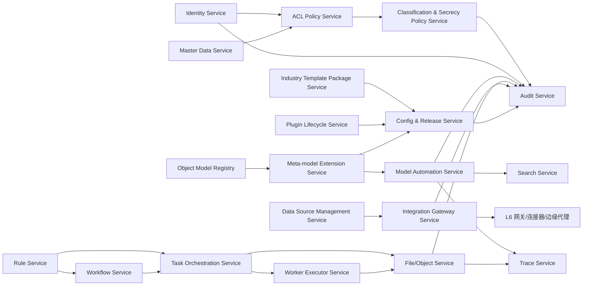
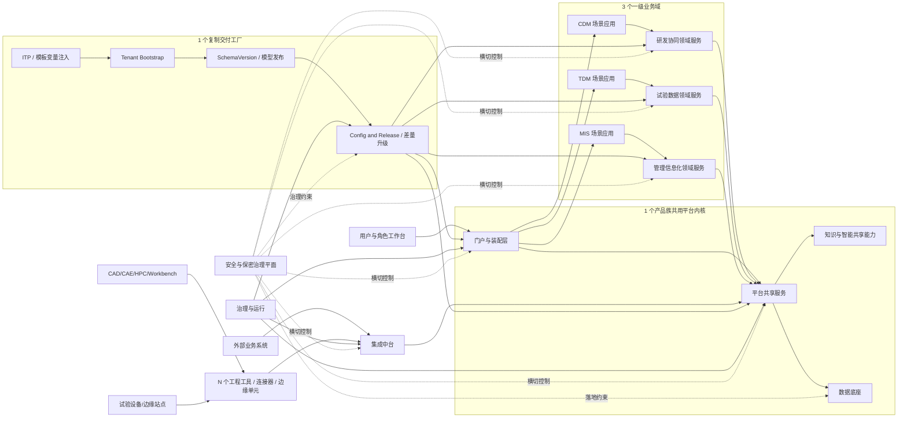
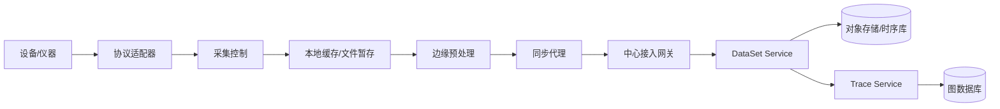

# 工业研发底座技术架构蓝图

状态：`Draft v0.4`  
日期：`2026-03-10`  
用途：基于前置研究、资产索引、统一能力地图、统一对象模型和 ADR 决策清单，给出底座的逻辑分层、横切平面、服务边界、部署分区、数据架构、集成拓扑与边缘架构参考蓝图。

---

## 1. 蓝图目标

本蓝图主要回答八个问题：

1. 底座整体应如何分层。
2. 哪些服务应进入共享平台，哪些保留在领域层。
3. `需求 -> 架构 -> 设计/仿真 -> 试验 -> 数据 -> 知识 -> 管理` 的数字主线如何贯通。
4. 数据、文件、图谱、时序、搜索和标准语义应如何分工。
5. 外部系统、设备、工具、Workbench 与边缘站点如何接入。
6. 安全、保密、审计、运维如何贯穿整个技术架构。
7. 现有 `CDM / TDM / MIS / OLTran` 资产如何逐步演进到统一底座。
8. 平台如何从“架构底座”演进成“可复制交付的产品化引擎”。

---

## 2. 架构驱动因素

## 2.1 业务驱动

- 同时支撑 `协同研发`、`数字化试验`、`管理信息化`
- 打通 `需求 -> 架构 -> 项目/工作包 -> 设计/仿真/试验 -> 数据 -> 知识 -> 管理`
- 支撑多站点试验接入、跨网传输和虚实融合
- 支撑多产品线复用和差异化交付
- 支撑行业模板包驱动的快速复制交付

## 2.2 技术驱动

- 现有资产已经具备微服务、多引擎、混合存储和高可用部署基础
- 平台必须把 `TODS/ASAM ODS` 与 `主数据/量纲单位体系` 视作标准语义资产，而不是附件资料
- 平台必须显式承载 `MBSE / 功能-逻辑-物理-接口` 架构对象链
- 平台必须兼容国产化环境
- 平台必须同时面向中心应用与边缘站点
- 平台必须同时面向 `Web Portal` 与 `Engineering Workbench`
- 低/无代码能力需要受控纳入，而不是另起一套平台

## 2.3 约束条件

- 当前没有正式 PRD，这是一版研究驱动型蓝图
- 不能假设所有旧系统可以一次性替换
- 不能以单一数据库或单一产品统一承载全部能力

---

## 3. 总体技术策略

## 3.1 推荐总体形态

建议采用：

- `产品族共用平台内核`
- `1 个平台内核 + 3 个一级业务域 + 1 个复制交付工厂 + N 个工程工具/连接器`
- `领域服务 + 平台共享服务 + 集成中台 + 数据底座 + 边缘接入`
- 中心侧 `微服务/模块化单体混合演进`
- 边缘侧 `代理化 + 缓存化 + 异步同步`
- `受控装配层 + 元模型驱动扩展体系`
- `七层逻辑分层 + 模型与标准语义平面 + 数字主线平面 + 复制交付平面 + 安全与保密治理平面`
- `复制引擎 = ITP + SchemaVersion + 租户初始化 + 发布后自动联动`
- `单实例 / 逻辑隔离 / 物理隔离` 三态部署策略
- `侧挂增强 + 受控 AI Worker` 双层智能策略

这里所说的“产品化引擎”，不是让装配层替代工业研发主线，而是让门户、台账、专题、审批、统计和对外协同等通用场景在统一对象模型、统一权限、统一发布治理之下快速装配；设计、仿真、试验主链路仍由领域服务、任务编排、工具流和数据流运行时承载。

## 3.2 不建议的形态

- 不做单一超级业务产品
- 不做纯流程平台
- 不做纯数据中台
- 不做通用低代码优先的平台

---

## 4. 逻辑架构蓝图

## 4.1 七层逻辑分层

| 层级              | 说明                         | 主要能力                                                                           |
| ----------------- | ---------------------------- | ---------------------------------------------------------------------------------- |
| L1 体验与装配层   | 统一入口和场景装配           | 门户、角色主页、工作台、表单、视图、看板、导航、页面区块、动作编排                 |
| L2 场景应用层     | 面向用户的业务应用           | CDM 应用、TDM 应用、MIS 应用、知识应用                                             |
| L3 领域服务层     | 承载领域语义和核心聚合根     | 需求、项目、工作包、任务、试验、数据集、合同、设备、知识                           |
| L4 平台共享服务层 | 承载共享内核能力             | 身份鉴别与访问控制、主数据、数据源管理、对象模型注册、对象与文件服务、轻量业务流程、任务编排、ACL 策略、密级与保密策略、加解密控制接口、元模型扩展、模板包装载、规则服务、搜索服务、数字主线服务、审计服务、集成控制面、配置发布、模型自动联动、插件生命周期、Worker 执行框架 |
| L5 数据与智能层   | 承载多模数据与检索知识底座   | 关系数据服务、文档数据服务、对象存储服务、图谱服务、测量/时序数据服务、搜索索引服务、知识库服务 |
| L6 集成与边缘层   | 承载外部系统、工具和设备接入 | API 网关、事件总线、文件交换、连接器、协议适配、HPC 代理、边缘代理                 |
| L7 治理与运行层   | 承载运行治理与非功能保障     | 配置、发布、观测、安全运营、等保/分保合规、三员治理、日志保全与留存、密钥治理、租户隔离、国产化、资产目录与复用运营、应用包发布与升级治理 |

## 4.2 四条横切平面

在保留七层逻辑分层的基础上，`v0.4` 建议显式增加四条横切平面：

### A. 模型与标准语义平面

- `MetaObjectType / SchemaVersion`
- `MBSE Architecture Meta Model`
- `ReferenceData / MeasurementQuantity / PhysicalUnit / Environment`
- `TODS Application Model Registry`

### B. 数字主线平面

- `Requirement -> Architecture`
- `Architecture -> Design / Simulation`
- `Simulation / Test -> DataSet / ResultPackage`
- `DataSet / Deliverable -> Knowledge / MIS`

### C. 复制交付平面

- `Industry Template Package`
- `Tenant Bootstrap`
- `模板变量注入`
- `发布后自动联动`

复制交付平面承载的不只是模板包本身，还应包括角色主页、页面区块、动作目录、连接器、数据源绑定、插件挂载点和初始化脚本的标准化声明，从而保证“同一能力、不同单位/项目/专题”的快速复制与受控差异化。

### D. 安全与保密治理平面

- `Identity / Authentication / Session`
- `ACL / Role / Scope / Action`
- `Classification / Secrecy / Export Control`
- `Audit / Log Retention / Replay`
- `Crypto / Key Usage / Decryption Authorization`
- `Three-admin Separation / Compliance Gate`

安全与保密治理平面不是附着在某一个服务上的“补丁”，而是对 L1-L7 全层生效的控制面。它要求身份、授权、密级、审计、加解密和高危变更审批在逻辑架构里有明确落点，并在运行时、技术实现和治理制度三个层面同时闭环。

### 4.2.1 装配层适用边界

- 门户、工作台、台账、专题分析、审批协同、统计看板等场景优先走装配层
- 设计、仿真、试验和工具流主链路不允许退化为装配层脚本编排
- 装配层只能消费已发布对象模型、数据源、区块、动作和连接器，不得绕开共享服务直接落库
- 轻量业务流程与工程流程分层建设，前者服务管理协同，后者服务研发执行

### 4.2.2 安全与保密能力分层归属表

安全与保密相关能力不能简单归入单一层级，而应拆成 `L4 运行时共享能力 + L5/L6 技术落点 + L7 治理与合规职责` 三层：

| 能力项 | L4 运行时共享能力 | L5/L6 技术落点 | L7 治理与合规职责 |
| --- | --- | --- | --- |
| 三员分立 | `Identity Service + ACL Policy Service + Audit Service + Config & Release Service` 负责管理账号、最小权限、管理面隔离和高危操作约束 | 管理面接入控制、审计日志落地、网关与边缘运维入口隔离 | 系统管理员、安全管理员、审计管理员职责分离、互斥授权和审批机制 |
| 身份鉴别与会话控制 | `Identity Service` 负责登录、SSO、会话、认证策略执行 | `API 网关 / 边缘代理 / 管理入口` 执行接入鉴权；敏感凭据不以明文落地 | 账号策略、口令/MFA 策略、等保认证配置 |
| 角色、对象与范围授权 | `ACL Policy Service + Master Data Service + Object Model Registry` 负责角色、对象、范围、动作级实时判定 | 网关与连接器执行访问拦截；持久化层按最小权限原则暴露数据 | 权限矩阵审批、特权账户治理、越权检查 |
| 密级与保密判定 | `Classification & Secrecy Policy Service + ACL Policy Service + File/Object Service` 负责人员密级、对象密级、导出/外发/脱密前置判定 | 密级字段、防篡改存储、文件元数据标签、跨网与边缘同步密级校验 | 密级制度、分级规则、保密审查和外发审批 |
| 日志审计与回放 | `Audit Service` 统一采集访问、变更、发布、导出、解密等审计事件 | 审计日志库、WORM/归档、网关/文件交换/边缘代理日志落地 | 留存周期、审计查看权限、日志保全和抽查机制 |
| 数据加密与解密控制 | `Crypto Policy Service + File/Object Service` 提供加密策略、解密授权、密钥调用接口和导出解密控制 | 关系库、文档库、对象存储、备份、边缘缓存和传输链路加密 | 密钥分级、轮换、算法合规、解密审批 |
| 传输加密与跨网控制 | `Integration Gateway Service + Data Source Management Service` 管理接口准入、交换策略、连接边界和审计规则 | `API 网关 / 文件交换 / 标准交换代理 / 边缘代理` 执行传输加密和跨网控制 | 跨网交换策略、接口准入和传输审批 |
| 发布与高危变更控制 | `Config & Release Service + Plugin Lifecycle Service + Industry Template Package Service` 管控模板、插件、配置和应用包发布 | 发布包签名、环境参数隔离、跨网发布通道控制 | 变更审批、基线管理、安全基线核查 |

这里的基本原则是：

- `L4` 负责运行时统一判定和统一执行。
- `L5/L6` 负责把这些策略真正落到存储、交换和边缘链路上。
- `L7` 负责制度、职责分离、留存、审计和合规责任。

### 4.2.3 L4 内部关系说明

L4 不是一组简单并列的共享服务，而是一张围绕“主体、对象、执行、留痕、发布”运转的共享内核网络。建议按五条主关系链理解：

1. **主体与安全控制链**
   - `Identity Service -> ACL Policy Service -> Classification & Secrecy Policy Service -> Audit Service`
   - `Master Data Service` 为组织、岗位、职责、角色范围提供基础参照。

2. **对象与模型控制链**
   - `Object Model Registry -> Meta-model Extension Service -> Model Automation Service`
   - 模型发布后自动联动 `Search Service / Trace Service / Audit Service`。

3. **流程与执行控制链**
   - `Rule Service -> Workflow Service / Task Orchestration Service -> Worker Executor Service -> File/Object Service`
   - 流程、任务、执行器和对象产物统一进入审计与主线追踪。

4. **集成与数据源控制链**
   - `Data Source Management Service -> Integration Gateway Service -> L6 运行时接入单元`
   - 数据源、连接器、网关策略和审计规则由 L4 统一控制，再由 L6 落地执行。

5. **复制交付与发布控制链**
   - `Industry Template Package Service / Plugin Lifecycle Service / Meta-model Extension Service -> Config & Release Service`
   - 模板包、插件、模型变更和环境发布统一收口到发布治理链路。

需要特别说明的是：`三员分立` 不是额外平铺出来的一个业务服务，而是 L7 治理角色模型在 L4 中通过 `Identity + ACL + Audit + Config & Release` 组合落地的运行时控制机制。

## 4.3 逻辑蓝图总图

为了让 `3.1 推荐总体形态` 在逻辑架构中可见，`4.3` 建议显式回答四个一级结构问题：

1. `1 个产品族共用平台内核` 到底包含哪些逻辑构件。
2. `3 个一级业务域` 分别如何承载场景应用和领域语义。
3. `1 个复制交付工厂` 是否作为独立一级构件存在，而不是散落在发布细节里。
4. `N 个工程工具/连接器/边缘单元` 通过什么接入控制面进入平台。

基于这个原则，逻辑总图建议按 `1 + 3 + 1 + N` 来画，而不是仅按“若干应用 + 若干服务”平铺。需要特别说明的是：

- `研发协同 / 试验数据 / 管理信息化` 是 `3 个一级业务域`。
- `知识与智能` 更适合作为平台内核上的共享增强能力，为三个一级业务域服务，而不建议在总体形态图中再单列成第 `4` 个一级业务域。
- `复制交付工厂` 应在逻辑蓝图里具名出现，否则“产品化引擎”会停留在总策略描述，无法形成架构辨识度。

---

## 5. 服务蓝图

## 5.1 平台共享服务

建议优先沉淀以下共享服务：

| 服务                              | 说明                                                 | 优先级 |
| --------------------------------- | ---------------------------------------------------- | ------ |
| Identity Service                  | 身份、SSO、角色、项目角色、组织映射                  | `P0`   |
| Master Data Service               | 组织、岗位、字典、编码、参照数据                     | `P0`   |
| Data Source Management Service    | 外部数据库、API、文件、总线数据源注册、映射、同步策略 | `P0`   |
| Object Model Registry             | 对象模型、扩展模型、对象类型注册                     | `P0`   |
| File/Object Service               | 文件、对象元数据、版本、归档、快照                   | `P0`   |
| Workflow Service                  | 审批流、轻量业务流程模板、流程实例                   | `P0`   |
| Task Orchestration Service        | 任务、待办、通知、状态流转、动作项                   | `P0`   |
| ACL Policy Service                | 角色、对象、密级、范围、页面能力与动作授权           | `P0`   |
| Classification & Secrecy Policy Service | 人员密级、对象密级、保密范围、脱密与外发前置判定 | `P0`   |
| Crypto Policy Service             | 加密策略、解密授权、密钥使用接口、导出解密控制       | `P0`   |
| Meta-model Extension Service      | 对象派生、模型版本、审批、发布、回滚                 | `P0`   |
| Industry Template Package Service | ITP 解析、依赖校验、包加载、差量升级、租户初始化     | `P0`   |
| Plugin Lifecycle Service          | 插件目录、挂载点、依赖、启停、升级、隔离             | `P1`   |
| Rule Service                      | 规则、校验、触发、策略判断                           | `P1`   |
| Search Service                    | 全文、条件、标签、黄页                               | `P0`   |
| Trace Service                     | 数字主线、谱系、影响分析                             | `P0`   |
| Audit Service                     | 对象、访问、发布、导出、配置审计                     | `P0`   |
| Integration Gateway Service       | API、事件、文件、连接器治理                          | `P0`   |
| Config & Release Service          | 配置中心、环境参数、发布包、灰度                     | `P0`   |
| Model Automation Service          | 模型发布后的索引、权限点、审计类别、基础视图自动注册 | `P1`   |
| Worker Executor Service           | 规则任务、脚本任务、AI Worker 节点执行控制           | `P1`   |

## 5.1.1 L4 共享服务精确定义与边界

L4 的关键不是“功能多”，而是这些能力必须被统一定义成平台共享内核，供 L1/L2/L3 复用，并接受统一治理。为避免后续设计和实施中出现歧义，建议按下表理解：

| 服务 | 精确定义 | 不负责什么 |
| --- | --- | --- |
| Identity Service | 管理用户、主体身份、认证、SSO、组织映射和项目角色绑定 | 不负责对象级授权判断，不负责业务对象语义 |
| Master Data Service | 管理组织、岗位、字典、编码、分类、参照数据等企业级主数据 | 不负责领域对象扩展，不负责外部系统接入逻辑 |
| Data Source Management Service | 管理外部数据库、API、文件、总线等数据源的注册、连接、映射、同步策略和凭据托管 | 不负责具体业务流程编排，不直接替代连接器运行时 |
| Object Model Registry | 管理对象类型、字段定义、状态机、持久化策略、白名单扩展边界和对象注册 | 不负责模型变更审批和发布执行 |
| File/Object Service | 统一管理对象元数据、文件引用、版本、快照、归档、检入检出和对象与文件的绑定关系 | 不负责具体业务审批语义，不负责大文件交换通道控制 |
| Workflow Service | 提供审批流和轻量业务流程的模板、实例和回调运行时 | 不承载设计、仿真、试验等工程主流程，不替代工具流/数据流引擎 |
| Task Orchestration Service | 提供任务、待办、通知、动作项、状态流转和责任分派能力 | 不等同于流程引擎，不负责 HPC 作业调度和边缘同步 |
| ACL Policy Service | 提供角色、对象、密级、范围、页面能力和动作授权的统一策略计算与判定 | 不负责用户认证登录，不直接保存业务对象 |
| Classification & Secrecy Policy Service | 提供人员密级、对象密级、级差匹配、导出/外发/脱密前置判定和保密规则执行 | 不负责账号登录认证，不直接替代正式保密制度审批 |
| Crypto Policy Service | 提供字段、文件、对象、传输等加解密策略编排，统一管理解密授权与密钥调用接口 | 不直接替代底层 KMS/HSM，不直接保存业务对象 |
| Meta-model Extension Service | 提供白名单对象的派生、SchemaVersion、模型审批、发布、回滚和兼容性校验 | 不允许重定义核心对象语义，不负责页面装配 |
| Industry Template Package Service | 负责 ITP 的解析、依赖校验、模板变量注入、租户初始化和差量升级 | 不负责内核升级，不绕开统一发布治理 |
| Rule Service | 提供校验、触发、计算和策略判断能力，作为共享规则执行底座 | 不承载长事务编排，不替代领域服务代码 |
| Search Service | 提供统一全文检索、条件检索、标签和黄页式召回能力 | 不等同于底层搜索引擎本身，不负责知识治理 |
| Trace Service | 提供数字主线、谱系关系、影响分析和跨对象追踪能力 | 不等同于图数据库本身，不替代领域对象主存 |
| Audit Service | 提供对象、访问、发布、导出、配置和安全相关操作的统一审计链路 | 不负责业务日志展示，不替代安全策略本身 |
| Integration Gateway Service | 作为平台级集成控制面，统一管理 API、事件、文件和连接器目录、策略与审计规则 | 不等同于 L6 的运行时网关、协议代理或边缘代理本体 |
| Config & Release Service | 负责配置中心、环境参数、发布包、灰度和回滚治理 | 不负责业务对象建模，不直接提供页面装配能力 |
| Model Automation Service | 在模型发布后自动注册索引、权限点、审计类别、基础视图等派生能力 | 不承诺一步到位生成完整业务 API 和完整应用 |
| Plugin Lifecycle Service | 管理插件目录、挂载点、依赖、启停、升级和隔离策略 | 不负责插件业务逻辑本身，不允许绕开权限与审计 |
| Worker Executor Service | 提供规则任务、脚本任务和 AI Worker 节点的受控执行框架 | 不直接定义知识语义，不负责跨租户无边界执行 |

需要特别强调七组边界：

- `Identity Service` 解决“你是谁”，`ACL Policy Service` 解决“你能对什么做什么”，`Classification & Secrecy Policy Service` 解决“在什么密级和保密边界下允许这样做”。
- `Crypto Policy Service` 解决“数据如何加密、谁可以在什么条件下解密”，而具体加密落盘和传输加密由 L5/L6 负责实现。
- `Object Model Registry` 解决“对象长什么样”，`Meta-model Extension Service` 解决“对象怎么受控扩展和发布”。
- `Workflow Service` 解决“审批和轻量业务流程如何跑”，`Task Orchestration Service` 解决“任务和待办如何协同”。
- `Search Service / Trace Service` 是共享能力服务；其底层分别依赖 L5 的搜索索引和图谱能力，但不等同于这些底层存储或引擎本身。
- `Integration Gateway Service` 是平台级接入控制面，真正的外部接入运行时在 L6。
- `三员分立` 是 L7 治理模型，在运行时通过 `Identity Service + ACL Policy Service + Audit Service + Config & Release Service` 协同落实，而不是单独新增一个孤立服务。

## 5.2 研发协同与系统工程领域服务

| 服务                       | 核心对象                     |
| -------------------------- | ---------------------------- |
| Requirement Service        | Requirement、RequirementItem |
| Architecture Service       | ArchitectureDefinition       |
| Function Architecture Service | FunctionArchitecture      |
| Logical Architecture Service  | LogicalArchitecture       |
| Physical Architecture Service | PhysicalArchitecture      |
| Interface Definition Service  | InterfaceSpec             |
| Project Service            | Project、Plan                |
| WorkPackage Service        | WBSNode、WorkPackage         |
| Task Collaboration Service | Task、ActionItem             |
| Review & Change Service    | Review、ChangeRequest        |
| Deliverable Service        | Deliverable                  |

## 5.3 试验数据领域服务

| 服务                   | 核心对象                                    |
| ---------------------- | ------------------------------------------- |
| Test Planning Service  | TestPlan、TestSpec                          |
| Test Execution Service | Test、MeasurementSchema、MeasurementChannel |
| DataSet Service        | DataSet、MeasurementSeries                  |
| Analysis Service       | AnalysisJob、AnalysisResult、TestReport     |
| Measurement Semantic Service | MeasurementQuantity、PhysicalUnit、Environment |
| TODS Model Registry Service  | TODSApplicationModel、ExchangePackage |
| ATF/XML Exchange Service     | ExchangePackage                        |
| Site & Device Service  | Site、Device                                |
| Edge Sync Service      | 边缘缓存、同步任务、断点续传状态            |

## 5.4 仿真与算力协同服务

| 服务                    | 核心对象                       |
| ----------------------- | ------------------------------ |
| Simulation Task Service | SimulationTask、TestSpec       |
| HPC Job Proxy Service   | HPCJob、ComputeQueue           |
| Result Package Service  | ResultPackage、ResultArtifact  |
| Engineering Workbench Session Service | WorkbenchSession、SimulationTask |
| Toolflow Orchestration Service | ToolflowRun、SimulationTask          |
| CAD/CAE Integration Runtime   | ToolSession、ResultArtifact          |
| Storage Tiering Service | 热/温/冷分层迁移策略、只读映射 |

## 5.5 管理信息化领域服务

| 服务                     | 核心对象                                                |
| ------------------------ | ------------------------------------------------------- |
| Annual Plan Service      | AnnualPlan                                              |
| Research Project Service | ResearchProject                                         |
| Research Governance Service | AnnualPlan、ResearchProject                           |
| Contract Service         | Contract、PaymentRecord                                 |
| Contract-to-Project Mapping Service | Contract、Project、ResearchProject            |
| Equipment Asset Service  | EquipmentAsset、BorrowRecord、RepairRecord、ScrapRecord |
| Equipment Master Index Service | Device、EquipmentAsset                              |
| Master Data Distribution Service | MasterDataItem、Organization、ReferenceData      |
| Approval Service         | ApprovalCase                                            |

## 5.6 知识与智能服务

| 服务                       | 核心对象                                        |
| -------------------------- | ----------------------------------------------- |
| Knowledge Service          | KnowledgeAsset、StandardItem                    |
| Taxonomy Service           | TaxonomyNode                                    |
| Semantic Retrieval Service | SemanticIndex                                   |
| AI Assistant Service       | PromptTemplate、问答与建议结果                  |
| AI Worker Executor Service | AIWorkerTask、PromptVersion、KnowledgeSourceRef |

## 5.7 装配与配置服务

装配层不另起一套业务平台，而是基于共享服务做可控装配：

| 服务                             | 说明                                         |
| -------------------------------- | -------------------------------------------- |
| View Template Service            | 页面、表单、列表、详情模板                   |
| Dashboard Service                | 看板、驾驶舱、工作台编排                     |
| Role Workspace Service           | 角色主页、导航、专题工作台编排               |
| Block & Action Registry Service  | 页面区块、对象动作、批量动作、挂载点目录     |
| Workflow Template Service        | 审批流、轻量业务流、任务流模板               |
| Light Integration Orchestration  | 轻量 API/事件/文件编排                       |
| Application Package Composer     | 场景装配结果、插件引用、配置快照、发布包组装 |
| Industry Template Package Loader | 行业模板包装载、变量注入、依赖校验、环境适配 |
| Tenant Bootstrap Service         | 租户、项目或站点的标准初始化流程             |

---

## 6. 数据架构蓝图

## 6.1 数据分层

建议把数据分为六层：

1. **主数据与标准语义层**
   - 组织、人员、岗位、字典、编码、量纲、单位、测量量、环境、参照数据

2. **核心业务对象层**
   - 需求、架构、项目、工作包、任务、试验、合同、设备、知识等核心对象

3. **领域应用模型层**
   - `MBSE Architecture Model`
   - `TODS Application Model`
   - 行业柔性对象模型

4. **数据资产层**
   - 文件、报告、模型、测量数据、分析结果、数据集、结果包

5. **关系与谱系层**
   - 主线、关系、影响、验证、知识网络

6. **分析与检索层**
   - 搜索索引、聚合视图、知识索引、报表快照、专题视图

## 6.2 存储矩阵

| 存储能力      | 适用对象                             |
| ------------- | ------------------------------------ |
| 关系型数据库  | 主数据、项目、合同、审批、权限       |
| 文档数据库    | 柔性对象、扩展属性、配置对象         |
| 对象存储      | 文件、报告、模型、采集原始包         |
| 时序/列式存储 | 测量序列、采集数据、监测数据         |
| 图数据库      | TraceLink、知识图谱、主线关系        |
| 搜索引擎      | 全文、标签、条件组合、语义召回前置层 |

推荐补充三类持久化实现策略：

- 核心对象：`关系主表 + 扩展表/JSON 扩展字段`
- 柔性领域对象：`JSON 字段 + 文档模型 + 搜索索引`
- 超大文件与结果包：`对象存储/分布式文件系统 + 对象元数据引用`

## 6.3 关键数据关系

- 核心对象元数据不直接散落在文件系统中，必须回到对象服务统一管理。
- 大文件与时序数据不强行进入关系库。
- `TraceLink` 和知识网络不落在普通业务表附属字段中。

## 6.4 主数据与对象注册

建议设置四个中心：

- **主数据中心**
  - 管理组织、岗位、用户、字典、编码、分类

- **对象注册中心**
  - 管理对象类型、扩展模型、字段定义、状态机、白名单扩展策略
  - 管理 `SchemaVersion`、持久化策略和自动联动注册入口

- **标准语义与架构模型注册中心**
  - 管理 `Architecture Meta Model`
  - 管理 `TODS Application Model`
  - 管理量纲、单位、环境和交换描述

- **数据源注册中心**
  - 管理数据源类型、连接参数、访问凭据托管、对象映射、同步策略和读写范围
  - 管理数据源与连接器、页面动作、模板包之间的依赖关系

## 6.5 元模型驱动扩展架构

建议把元模型驱动扩展体系分成七个子能力：

- 模型注册
- 模型派生
- 模型审批
- 模型发布与回滚
- 模型存储映射
- 模型变更事件
- 模型自动联动注册

约束原则：

- 核心对象不允许被直接重定义
- 柔性领域对象允许在白名单下派生
- 模型变更必须进入版本、审计和发布链路
- `TestSpec / MeasurementSchema / TODSApplicationModel / DeliverableType / ReviewTemplate` 等对象作为首批重点支持对象
- `MeasurementQuantity / PhysicalUnit / Environment / ArchitectureDefinition` 只能走模型审批流，不允许由场景装配层直接改写
- `Phase 1` 先做发布后的自动联动注册，不承诺一步到位自动生成完整 API
- `Phase 2` 再进入受控的模型驱动 API 和基础视图生成

## 6.6 复制引擎与模板包运行机制

建议把快速复制交付能力显性化为 `复制引擎`，最小闭环包括：

1. `Industry Template Package Service` 解析 `manifest.yaml`
2. `Meta-model Extension Service` 完成模型校验与 `SchemaVersion` 对比
3. `Tenant Bootstrap Service` 完成租户、项目、主数据和模板初始化
4. `Data Source Management Service` 完成数据源绑定、连接校验和权限域注入
5. `Model Automation Service` 自动注册权限点、审计类别、搜索索引和基础视图
6. `Config & Release Service` 负责环境发布、回滚和差量升级

核心要求：

- 模板包加载必须有环境变量注入与密级检查
- 模板包升级必须保留客户差量，并进入受控升级链路
- 模板包声明的数据源、页面区块、动作和插件依赖必须在装载前完成一致性校验
- 模板包清单必须预留插件挂载点，为 Phase 3 生态开放做准备

## 6.7 仿真结果分层策略

针对 CAE/SPDM/HPC 场景，建议对结果文件采用：

- 热层：近期任务结果，便于快速回看与二次分析
- 温层：阶段性结果包，支持项目复盘和评审
- 冷层：长期归档结果，按对象存储或只读映射管理

大规模网格文件、求解结果和中间文件应与业务元数据分离治理。

---

## 7. 集成架构蓝图

## 7.1 五类集成面

| 集成面         | 适用场景                               |
| -------------- | -------------------------------------- |
| API            | 业务对象服务调用、同步查询、事务请求   |
| Event          | 异步通知、状态变化、索引刷新、主线更新 |
| File           | 批量数据、模型包、报告、原始文件交换   |
| Agent/Protocol | 外部工具、本地脚本、设备协议、边缘采集 |
| Standard Exchange | `TODS API`、`ATF/XML`、标准化结果包交换 |

## 7.1.1 L6 对象关系说明

L6 中各对象不是并列的业务服务，而是围绕“外部接入与受控交换”形成的协作关系。建议按三层理解：

- **通道层**
  - `API 网关`
  - `事件总线`
  - `文件交换`
  - 负责定义同步调用、异步联动和大文件传输三条基础通道。

- **适配执行层**
  - `连接器`
  - `协议适配器`
  - `HPC 代理`
  - 负责把不同外部系统、工具、设备和算力环境映射为平台可消费的受控接入单元。

- **边缘运行层**
  - `边缘代理`
  - 负责在站点侧、本地网或隔离区承载协议适配、缓存、预处理、同步和安全控制。

一句话概括：`API 网关 / 事件总线 / 文件交换` 是通道，`连接器 / 协议适配器 / HPC 代理 / 边缘代理` 是依附这些通道运行的执行单元。

各对象之间的主关系如下：

| 对象 | 关系定位 | 与其他对象的主要关系 |
| --- | --- | --- |
| API 网关 | 同步入口 | 为连接器、工具运行时、外部业务系统提供统一入口；不直接承载业务语义 |
| 事件总线 | 异步骨架 | 为连接器和领域服务之间提供状态通知、自动联动和最终一致性通道 |
| 文件交换 | 大文件通道 | 为模型包、结果包、原始采集包提供传输通路；与连接器、HPC 代理、边缘代理协同 |
| 连接器 | 标准接入单元 | 通过 API、Event、File 三类通道之一或组合接入平台；可封装 IT 系统、工具、文件、设备、标准交换能力 |
| 协议适配器 | 底层协议翻译单元 | 通常运行在边缘代理内部，把 OT 协议、仪器协议或本地接口转换成平台可处理格式 |
| HPC 代理 | 算力接入专用代理 | 接收平台作业指令，向调度器或算力代理提交作业，并通过文件交换和回调把结果回收到中心 |
| 边缘代理 | 站点侧运行容器 | 承载协议适配、本地缓存、预处理、同步和安全代理；是设备侧接入和跨网交换的本地控制点 |

建议把这组关系再收敛为四条固定链路：

1. **业务系统接入链路**
   - 外部系统 -> `API 网关` -> `连接器` -> 平台共享服务或领域服务
   - 如果需要异步刷新索引、审计或主线关系，再通过 `事件总线` 进行后续联动。

2. **设备与站点接入链路**
   - 设备/仪器 -> `协议适配器` -> `边缘代理` -> `同步代理/标准交换代理` -> 中心接入
   - 该链路优先解决离线采集、断点续传、本地预处理和跨网受控传输问题。

3. **工具与本地执行链路**
   - `Engineering Workbench` 或外部工具 -> `API 网关` 或 `Agent/Protocol` -> 工具连接器/工具运行时
   - 该链路解决 CAD/CAE/CAM、本地脚本、插件化工具调用和结果回传。

4. **仿真与超算接入链路**
   - `Simulation Task Service` -> `HPC 代理` -> Scheduler/Agent
   - 结果文件通过 `文件交换` 或对象映射回收，状态与审计通过 `API` 或 `Event` 回写平台。

为避免后续实现混淆，边界上应遵循以下原则：

- `API 网关` 只负责统一入口，不负责系统适配。
- `连接器` 负责接入映射，不负责重定义业务语义。
- `协议适配器` 负责协议翻译，不负责中心侧治理。
- `边缘代理` 负责边缘自治与受控同步，不直接演变成业务中心。
- `HPC 代理` 是算力接入桥，不是算力平台本身。

## 7.2 连接器治理

建议建立统一连接器与数据源目录，连接器分五类：

- IT 系统连接器
- 工具连接器
- 文件交换连接器
- OT/设备协议连接器
- 标准交换连接器

每个连接器至少登记：

- 连接器名称
- 类型
- 数据源标识
- 归属系统
- 认证方式
- 数据方向
- 映射对象与读写范围
- 同步策略
- 审计等级
- 运行位置
- 责任团队

## 7.3 集成策略

- 同步调用优先使用 API
- 异步联动优先使用 Event
- 大文件优先使用 File 通道
- 本地执行与设备接入优先使用 Agent/Protocol
- 标准模型、跨网测量语义交换优先使用 Standard Exchange
- 主数据分发应由平台统一发布订阅，不再按系统点对点脚本同步

模型发布后的标准联动链路建议固定为：

`SchemaVersion 发布 -> Event Bus -> Search/Audit/Permission/View/Trace 注册器 -> 环境发布`

## 7.4 CAE/SPDM/HPC 集成专题

对仿真与超算场景，建议显性纳入以下集成链路：

- `Simulation Task Service -> HPC Job Proxy Service -> Scheduler/Agent`
- `Engineering Workbench Session Service -> CAD/CAE Tool Runtime -> Result Package Service`
- `Result Package Service -> Storage Tiering Service -> 对象存储/分布式文件映射`
- `Trace Service -> Knowledge Service` 回收求解结果与经验

关键控制点：

- 作业提交与回调审计
- 结果包映射和版本绑定
- 大文件分层与只读映射
- 任务失败重试与人工接管

## 7.5 模型驱动自动联动专题

Phase 1 自动联动范围建议限定为：

- 搜索索引定义
- 审计对象类型
- 权限点与菜单能力点
- 基础列表/详情视图脚手架
- 图谱关系与主线订阅

Phase 2 再进入：

- 模型驱动 API 自动生成
- SDK 元数据生成
- 模板包级的连接器自动装配

---

## 8. 部署架构蓝图

## 8.1 部署分区

建议至少划分八个部署区：

| 分区   | 说明                                   |
| ------ | -------------------------------------- |
| 入口区 | 负载均衡、WAF、统一入口、门户前端      |
| 工程客户端区 | Workbench、插件、模型浏览器、工具会话代理 |
| 应用区 | 场景应用服务与领域服务                 |
| 平台区 | 共享服务、流程、任务、对象、集成控制面 |
| 数据区 | 数据库、对象存储、搜索、图谱、时序     |
| 集成区 | API 网关、连接器、文件交换、工具代理   |
| 标准交换区 | TODS API、ATF/XML、跨网交换控制面      |
| 边缘区 | 站点代理、协议适配、本地缓存、断点续传 |

## 8.2 高可用基线

对 `P0` 共享服务建议采用：

- 多实例部署
- 网关高可用
- 配置中心高可用
- 消息中间件高可用
- 对象存储高可用
- 核心数据库主备或集群
- 搜索和缓存集群

## 8.3 推荐分层部署原则

- 门户前端与领域服务分离部署
- 共享服务与领域服务逻辑分组、物理可同区
- 集成代理与核心交易服务隔离部署
- 边缘节点独立运行，中心不可强依赖边缘在线

## 8.4 部署隔离与租户策略矩阵

| 模式         | 适用场景                     | 服务隔离                     | 数据隔离                                     |
| ------------ | ---------------------------- | ---------------------------- | -------------------------------------------- |
| 单实例模式   | 单法人、单单位客户           | 单套服务                     | 单套数据                                     |
| 逻辑隔离模式 | 集团内多法人、多单位协同     | 同一平台多命名空间或逻辑隔离 | 分库/分 schema/分桶策略                      |
| 物理隔离模式 | 高保密、军工、内外网隔离客户 | 独立集群或独立环境           | 独立数据库、独立对象存储、独立搜索与消息集群 |

补充要求：

- 主数据分发必须支持按隔离域订阅
- 搜索、缓存、消息和对象存储要有一致的隔离粒度
- 低/无代码模板和 AI Worker 配置也必须遵循同一隔离域

---

## 9. TDM 边缘架构蓝图

## 9.1 边缘侧组件

建议边缘节点包含：

- 协议适配器
- 采集控制组件
- 本地语义映射代理
- 本地缓存
- 文件暂存
- 预处理组件
- 标准交换代理
- 同步代理
- 安全代理

## 9.2 边缘到中心的数据流

## 9.3 边缘策略

- 允许离线采集
- 允许断点续传
- 允许边缘预清洗和元数据抽取
- 中心只接收受控数据与元数据，不直接暴露内部存储

---

## 10. 安全与治理蓝图

## 10.1 统一安全控制点

安全控制至少要覆盖：

- 登录和身份认证
- 角色、对象、范围和密级判定
- API 与事件授权
- 对象读取和对象变更
- 文件下载、导出和解密
- 数据源绑定和连接器启停
- 插件、模板与低代码发布
- 边缘上传与跨网传输
- 密钥调用与解密授权
- 三员高危操作分权

## 10.2 统一审计控制点

审计至少要覆盖：

- 登录成功/失败与高危认证事件
- 对象生命周期变化
- 权限变化
- 密级变化与解密授权
- 基线冻结
- 文件访问、导出和外发
- 数据源配置和权限边界变化
- 连接器调用
- 插件安装、启停和升级
- 低代码配置发布
- 跨网传输
- 三员高危操作

## 10.3 治理组织建议

建议在平台级建立四个常设治理小组：

- **模型治理委员会**
  - 负责核心对象、`SchemaVersion`、兼容性评审
- **标准语义委员会**
  - 负责 `主数据 + 量纲单位 + TODS/ODS` 兼容策略
- **产品复制治理小组**
  - 负责 `ITP`、插件、应用包、角色工作台资产、初始化流程、差量升级和模板资产准入
- **安全与保密治理小组**
  - 负责等保/分保、三员分立、密级策略、日志保全、密钥治理和高危变更审查

这里的两个治理对象需要明确区分：

- `资产目录与复用运营`：面向模板、页面区块、动作、连接器、插件等可复用资产，负责目录化、分级、上下架、所有权和复用统计
- `应用包发布与升级治理`：面向 `ITP`、专题应用包和交付包，负责准入、依赖、版本、初始化、发布、回滚和差量升级

## 10.4 低/无代码治理位置

低/无代码运行时必须放在：

- 统一权限模型之下
- 统一对象模型之上
- 统一数据源目录之上
- 已发布区块、动作、连接器和插件目录之内
- 统一发布治理之内

而不是成为绕开底座的“第二平台”。

## 10.5 AI Worker 治理位置

AI Worker 必须放在：

- 工作流和任务编排框架之内
- 审计和回放链路之内
- 提示词版本管理和知识来源追踪之内

不允许：

- 直接绕过人工责任人提交核心对象
- 在无审计情况下调用外部模型或知识源
- 在隔离域之外跨租户读取知识与数据

---

## 11. 运维与可观测性蓝图

## 11.1 观测内容

- 服务日志
- 业务指标
- 链路追踪
- 任务积压
- 文件交换状态
- 边缘同步状态
- 连接器健康状态

## 11.2 运维对象

建议把以下对象纳入统一运维台账：

- 服务实例
- 连接器实例
- 边缘节点
- 发布包
- 配置版本
- 存储资源

## 11.3 运行治理建议

- 平台共享服务必须统一监控
- 领域服务允许按产品线分责任运维
- 边缘节点要具备远程诊断和升级能力

---

## 12. 参考实现策略

## 12.1 当前技术资产兼容方向

从现有资料看，平台已有或已规划以下技术能力：

- 网关与高可用入口
- 配置/注册中心
- 缓存与消息中间件
- 对象/文件存储
- 关系型数据库
- 文档数据库
- 搜索引擎
- 图数据库

蓝图建议是：

- 在能力层统一，不在文档层强行绑定单一厂商
- 现有技术栈可作为 `参考实现`
- 后续正式版本再按国产化、采购和运维约束做具体选型

## 12.2 服务拆分节奏

建议按三批拆分：

### 第一批

- Identity
- Master Data
- Data Source Management
- Object Registry
- Architecture Meta Model Registry
- TODS Application Model Registry
- File/Object
- Workflow
- Task Orchestration
- ACL Policy
- Meta-model Extension
- Industry Template Package
- Tenant Bootstrap
- Config & Release
- Search
- Audit

### 第二批

- Requirement
- Architecture
- Project
- WorkPackage
- Test
- DataSet
- Contract
- Equipment
- Trace
- Model Automation
- HPC Job Proxy
- Result Package

### 第三批

- Knowledge
- Semantic Retrieval
- AI Assistant
- AI Worker Executor
- 角色工作台、区块动作与装配模板服务
- Plugin Lifecycle
- 高级集成编排

---

## 13. 对实施的直接指导

如果按这份蓝图推进，实施顺序建议是：

1. 先做 `纵切 A`：`Requirement + ArchitectureDefinition + TestSpec + MeasurementSchema + DataSet + TraceLink`
2. 并行做 `纵切 B`：`ITP + SchemaVersion + Tenant Bootstrap + Data Source Registry + TDM 柔性对象`
3. 再落平台共享服务的控制面
4. 再收敛对象模型和领域服务
5. 再建设 TDM 边缘接入、Workbench 通道与 HPC 代理链路
6. 再建设角色工作台装配、区块与动作目录、插件生命周期和模型自动联动
7. 最后建设受控 API 自动生成、知识增强与 AI Worker

换句话说，`v0.4` 不再只验证“复制引擎最小闭环”，而要同时验证“工业语义主线最小闭环”。

---

## 14. 证据链

### 核心输入

- `/Users/enjoyjavapan163.com/Documents/方案雏形/4- 基础底座/_bmad-output/planning-artifacts/architecture/industrial-base-architecture-and-governance-draft-2026-03-08.md`
- `/Users/enjoyjavapan163.com/Documents/方案雏形/4- 基础底座/_bmad-output/planning-artifacts/architecture/industrial-base-unified-capability-map-2026-03-08.md`
- `/Users/enjoyjavapan163.com/Documents/方案雏形/4- 基础底座/_bmad-output/planning-artifacts/architecture/industrial-base-unified-object-model-2026-03-08.md`
- `/Users/enjoyjavapan163.com/Documents/方案雏形/4- 基础底座/_bmad-output/planning-artifacts/architecture/industrial-base-adr-decision-list-2026-03-08.md`
- `/Users/enjoyjavapan/Documents/方案雏形/4- 基础底座/_bmad-output/planning-artifacts/architecture/industrial-base-technical-architecture-blueprint-refactor-recommendations-2026-03-10.md`
- `/Users/enjoyjavapan163.com/Documents/方案雏形/4- 基础底座/_bmad-output/planning-artifacts/architecture/industrial-base-adr-017-itp-standard-2026-03-08.md`
- `/Users/enjoyjavapan163.com/Documents/方案雏形/4- 基础底座/_bmad-output/planning-artifacts/architecture/industrial-base-extension-governance-framework-2026-03-08.md`
- `/Users/enjoyjavapan163.com/Documents/方案雏形/4- 基础底座/_bmad-output/planning-artifacts/architecture/industrial-base-phase0-vertical-slice-plan-2026-03-08.md`
- `/Users/enjoyjavapan163.com/Documents/方案雏形/4- 基础底座/_bmad-output/planning-artifacts/architecture/industrial-base-schema-version-evolution-strategy-2026-03-08.md`
- `/Users/enjoyjavapan163.com/Documents/方案雏形/4- 基础底座/_bmad-output/planning-artifacts/architecture/industrial-base-model-driven-automation-strategy-2026-03-08.md`
- `/Users/enjoyjavapan163.com/Documents/方案雏形/4- 基础底座/_bmad-output/planning-artifacts/architecture/industrial-base-replication-delivery-metrics-2026-03-08.md`
- `/Users/enjoyjavapan163.com/Documents/方案雏形/4- 基础底座/_bmad-output/planning-artifacts/research/industrial-base-asset-business-model-2026-03-08.md`

### 自有资料

- `/Users/enjoyjavapan/Documents/方案雏形/4- 基础底座/docs/reference/INDEX.md`
- `/Users/enjoyjavapan163.com/Documents/方案雏形/4- 基础底座/docs/reference/3-协同研发/协同研发平台产品白皮书-2024.docx`
- `/Users/enjoyjavapan163.com/Documents/方案雏形/4- 基础底座/docs/reference/3-协同研发/技术方案.docx`
- `/Users/enjoyjavapan163.com/Documents/方案雏形/4- 基础底座/docs/reference/1-TDM/数字化试验体系产品2024版.pptx`
- `/Users/enjoyjavapan163.com/Documents/方案雏形/4- 基础底座/docs/reference/2-管理信息化/科研业务管理系统（一期）系统安装手册v1.0.docx`
- `/Users/enjoyjavapan163.com/Documents/方案雏形/4- 基础底座/docs/reference/2-管理信息化/主数据管理系统操作手册v1.0.doc`

### 多模态图片证据

- `/Users/enjoyjavapan163.com/Documents/方案雏形/4- 基础底座/_bmad-output/planning-artifacts/research/extracted_images/collab_app_arch.png`
- `/Users/enjoyjavapan163.com/Documents/方案雏形/4- 基础底座/_bmad-output/planning-artifacts/research/extracted_images/collab_tech_arch.png`
- `/Users/enjoyjavapan163.com/Documents/方案雏形/4- 基础底座/_bmad-output/planning-artifacts/research/extracted_images/collab_deploy_arch.png`
- `/Users/enjoyjavapan163.com/Documents/方案雏形/4- 基础底座/_bmad-output/planning-artifacts/research/extracted_images/tdm_modeling.png`
- `/Users/enjoyjavapan163.com/Documents/方案雏形/4- 基础底座/_bmad-output/planning-artifacts/research/extracted_images/tdm_command_center.png`

---

## 15. 当前版本结论

这份 `v0.4` 蓝图的核心不是把所有功能塞进一张大架构图，而是明确：

- 共享平台服务放在哪
- 领域服务边界画在哪
- 多模数据各自落在哪
- 外部系统与边缘站点从哪接入
- `MBSE / 架构对象链` 和 `TODS 标准语义层` 放在哪
- 安全、审计、发布和低代码从哪条治理链路经过
- `ITP + SchemaVersion + 自动联动 + 初始化流程` 如何构成复制引擎

如果这些位置不先固定，后续任何开发计划都会重新回到“项目制拼装”。
