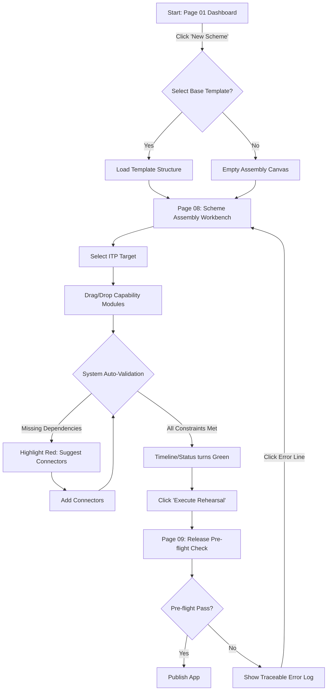
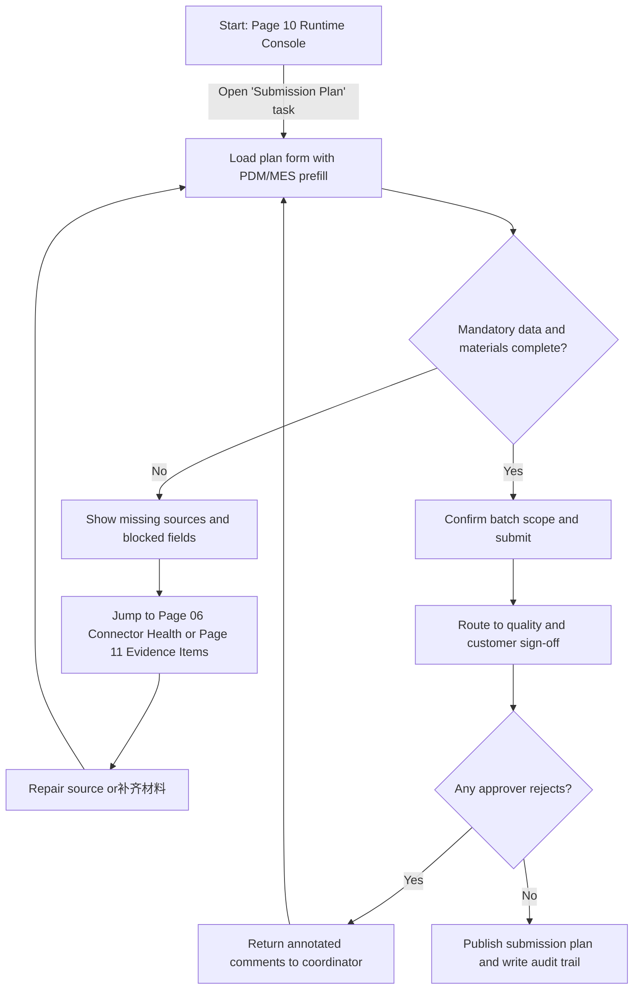
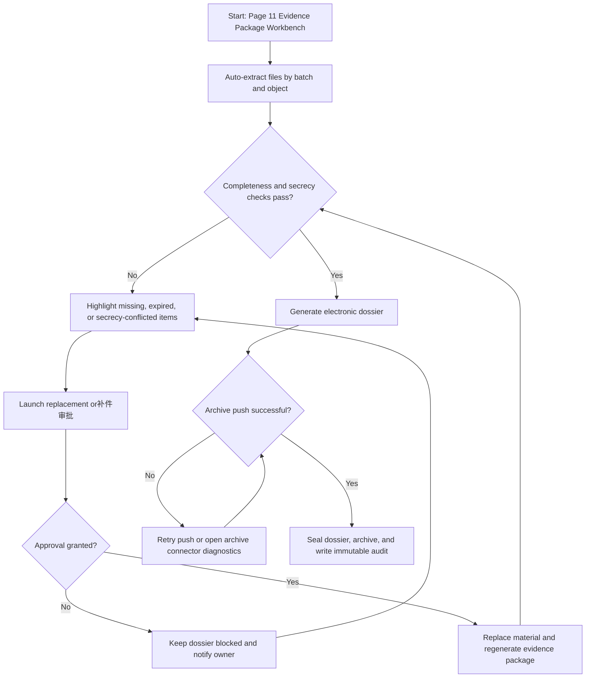
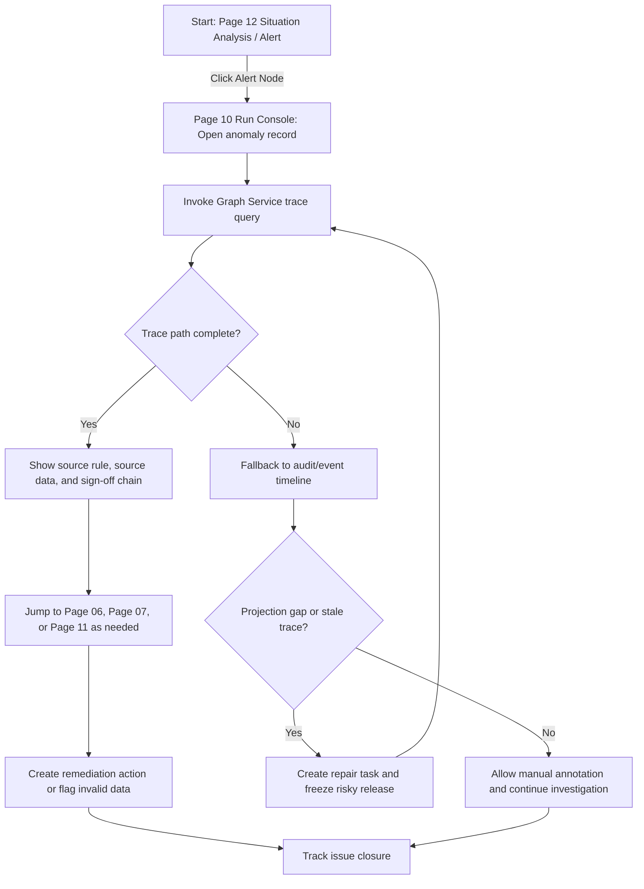

# UX Design Specification 4- 基础底座

**Author:** DuanDuanPan
**Date:** 2026-03-12

---

<!-- UX design content will be appended sequentially through collaborative workflow steps -->

## Executive Summary

### Project Vision

数字化验收平台 12 页原型旨在演示面向多型号、多批次的军检典型场景全链路，并以 HJ-2403 型号、批次 A-17 作为统一示例上下文。它的核心愿景是让用户直观看到：平台基线 + 验收方案 ITP + 能力模块 + 连接器组 + 客户差量，是如何从“建模 (Modeling)”一步步进入“装配 (Assembly)”、“发布 (Release)”以及最终的“可运行应用 (Runtime Application)”。原型需强调平台级口径，即“先定义应用和对象，再进行流程和页面编排”。

### Target Users

核心目标用户群体包括参与数字化军检验收全业务链路的各方角色：
- **质量部** 与 **客户代表** (直接参与验收与签审审核)
- **计划部** (参与提交计划生成与发布)
- **生产单位** / **工艺研究所** / **产品设计所** (涉及前端数据源、实物检验、资料准备与技术状态审查等环节)

### Key Design Challenges

- **概念抽象可视化的平衡：** 平台涉及大量底层概念（ITP、ODS/TODS映射、TraceLink、工作流/任务编排协同），需将其转化为易于理解的可视化建模工作台界面。
- **页面功能的深度展现：** 规则要求原型必须看似可操作的“功能页”（包含各类表单、树状图、列表、拖拽画布），避免画成纯说明性的“海报板”。
- **一致的故事主线连贯性：** 12 个完全不同阶段的页面需要围绕同一组示例上下文（当前选中的型号 / 批次）及同一套状态扭转逻辑保持视觉和数据上的高度连贯。

### Design Opportunities

- **构建连贯的建模工作流 (Modeling Workflow)：** 可以利用渐进式披露、分步向导架构，通过灵活的画布 (Canvas) 界面和分屏布局，展现“拖拽式”的应用构建体验，提供极佳的掌控感。
- **态势感知与运行追踪 (Situational Awareness & Traceability)：** 针对“运行主控台”和“追溯与态势分析页”，有机会运用数据可视化 (Data Viz) 设计、动态大屏布局与风险高亮反馈组件，打造极具专业感和现代科技感的“指挥中心”体验。

## Core User Experience

### Defining Experience

- **核心动作 (Core Action):** 用户最核心、最频繁的动作是 **“配置与编排”**（对于前台管理角色）以及 **“审查与确认”**（对于一线业务角色如质量部/客户代表）。
- **关键一击 (Critical Success):** 平台的核心体验在于让“原本零散的业务在线化”变成了“结构化的方案组装”。只要用户能顺畅地在“建模工作台”中将各个节点（对象、页面、流程、数据源）拼装成一个可视化的“验收方案”，并一键查看到运行态（主控台），这个体验就成功了。

### Platform Strategy

- **主要平台:** 桌面端 Web 应用（大屏显示优化）。
- **交互方式:** 强依赖鼠标/键盘操作。包括大量的拖拽（流程编排、视图搭建）、复杂表单填写、树状图导航与数据图表下钻。
- **特定要求:**
  - 需适配宽屏/大屏，因为有复杂的画布节点展示及态势分析大屏数据。
  - 涉及到大量外部系统接入与数据摆渡策略配置，界面需承载高信息密度。

### Effortless Interactions

- **应用骨架预览:** 在填写基础配置时（如 Page 02 新建应用），右侧实时预览应做到**“所见即所得”**，零延迟反馈。
- **拖拽式编排:** 在流程与编排页（Page 05），节点的连线、属性展开应顺滑无缝。
- **状态联动:** 当在装配台（Page 08）勾选能力模块或连接器时，底部的“全链路状态条”或“风险告警”应实现秒级的自动刷新校验，无需用户手动点击“检查”。
- **文件抽取与齐套校验:** 在证据包与电子卷宗页（Page 11），所有的资料抽取与完整性校验应在后台静默或一键自动完成，无需用户逐个文件比对。

### Critical Success Moments

- **装配成功的“Aha”时刻:** 当用户在“方案装配台”完成所有组件的勾选和连接器映射，点击预演，看到无红色风险阻断时的那种掌控感。
- **业务流转的清晰感:** 在“运行主控台”中，能够清晰看到当前批次的实时检验状态（绿灯/红灯/黄灯警告），以及数据回溯时的秒级展开。如果态势追踪（溯源树）无法直观显示上下游关系，将严重破坏专业感。

### Experience Principles

- **[全局把控]** 始终在页面边缘（导航或状态栏）提供当前方案在“总链路（建模->装配->运行）”中的位置感知。
- **[渐进式披露]** 面对复杂的 ODS 映射和 TraceLink 机制，默认折叠高级配置，只在用户需要时通过右侧面板或弹窗展开，确保主界面的清晰。
- **[即时反馈与校验]** 所有涉及连接器、审批流、权限发布的配置，都要在用户配置离开焦点或保存时立即给予前置风险校验反馈。
- **[数据驱动的视觉引导]** 运行态的页面（主控台、态势看板）弱化表单感，强化数据块、状态标签卡片与流向关系图，以数据和状态变化驱动用户视觉焦点。

## Desired Emotional Response

### Primary Emotional Goals

- **专业与掌控感 (Professionalism & Control):** 这是数字化验收平台最核心的情感基调。作为应对复杂军检业务的 B 端系统，用户必须在每一次拖拽、每一次配置中感受到平台底层的严谨性与高度的自定义能力。
- **秩序感 (Sense of Order):** 面对庞杂的数据（从计划提交到资料审查，再到 PDM/MES/测试设备的数据接入），用户需要感受到一切都在井然有序的规则（ITP、治理模型）下流转。

### Emotional Journey Mapping

- **建模阶段 (Page 02-07):** 探索与赋能。用户在此阶段像是一个架构师，感受到平台提供了强大的能力和工具。预期情绪是“清晰、专注、充满创造力和掌控感”。
- **装配与发布阶段 (Page 08-09):** 审慎与安心。这是配置落地到运行的临界点。系统应通过清晰的预演、无死角的依赖检查，赋予用户“胸有成竹、安全着陆”的踏实感。
- **运行与追溯阶段 (Page 10-12):** 洞察与信赖。当业务真正跑起来，系统替用户进行各种自动化操作（资料齐套校验、风险预警），用户的情绪应转变为“全局在握的安心感与对系统高度集成的信任体验”。

### Micro-Emotions

- **确定性 (Certainty) vs. 迷茫 (Confusion):** 在进行 ODS 映射或复杂的连接器配置时，提供即时校验反馈，将用户的迷茫转化为“我配对了”的确定性。
- **成就感 (Accomplishment) vs. 挫败感 (Frustration):** 当用户成功完成一个完整验收链路的拖拽式编排，或看到“电子卷宗”一键无错生成时，界面应提供正向引导，增强用户的获得感与业务成就感。
- **警觉 (Alertness) vs. 焦虑 (Anxiety):** 在态势看板与风险预警设计上，通过克制但明确的视觉提示（如特定的告警颜色和微动效），让用户保持对异动风险的警觉，但不至于产生对系统故障的焦虑感。

### Design Implications

- **为“掌控感”设计:** 采用沉稳的深色偏灰或高级的工业蓝作为主色调，避免跳跃轻浮的色彩。控件设计以方正、边界清晰的风格为主（如硬朗的卡片边缘、规整的树状结构线）。
- **为“秩序感”设计:** 强调整齐划一的栅格系统。在复杂的表单和编排画布中，确保模块的视觉间距严格遵循一套间距规范。使用高对比度的字体层级来区分主信息（如当前选中的批次号）与次要属性（如内置节点 ID）。
- **为“安心与确定”设计:** 无论是操作前（如动作面板的危险操作二次确认提示），还是操作后（如微小的 Toast 成功反馈，以及预演发布界面的全绿勾选状态），反馈机制必须做到 100% 的闭环。

### Emotional Design Principles

1. **功能展现先于形式装饰:** 一切视觉元素服务于传达业务结构的清晰度，不使用无意义的插画或过度装饰的背景。
2. **克制且精准的异常表达:** 对于错误或告警，必须给出明确的“发生位置 + 原因 + 建议行动”，而不是冰冷的面包屑报错，从而消除用户焦虑。
3. **操作节奏的呼吸感:** 在高信息密度的全屏画布旁，留出充足的负空间（Negative Space）作为“呼吸区”，防止视觉疲劳。

## UX Pattern Analysis & Inspiration

### Inspiring Products Analysis

为了让数字化平台不仅可用，而且“好用”并具备高级感，我们参考了以下在 B 端领域表现卓越的产品：

- **Figma / 蓝湖:** 作为设计协作平台，其无极缩放画布、自由拖拽、右侧极其详尽但不杂乱的属性面板，是将“复杂配置”优雅收纳的典范。
- **Snowflake / 阿里云 DataWorks:** 在涉及数据源配置、ETL 链路编排时，它们提供的“基于节点的编排流程 (Node-based Graph)”、明确的数据连通性测试反馈以及清晰的日志追踪体系，是构建可信赖数据编排工具的标杆。
- **Notion:** 其“/”命令的快捷呼出、极其干净的界面以及通过 Block 自由组合内容的块级编辑体验，为复杂系统的“零摩擦界面”提供了绝佳的降噪参考。

### Transferable UX Patterns

基于上述产品的成功经验，我们可以将以下模式迁移至 4- 基础底座中：

**Navigation Patterns:**
- **折叠式左侧全局导航与沉浸式画布：** 在“应用建模”与“方案装配”等核心页面，采用左侧可折叠的资源树导航，最大化中间的画布/配置区，让用户始终专注于主任务。

**Interaction Patterns:**
- **画布节点编排与即时连线验证：** 在“流程与编排”页，采用拖拽节点及吸附连线，并带有语法/逻辑实时错误校验提示（如连线变红伴随悬浮提示）。
- **右侧抽屉式 (Drawer) 详尽配置面板：** 对于极其复杂的 TraceLink 和 ODS 字段映射，点击画布上的节点后，从右侧滑出抽屉式面板显示高级配置，保证主界面的开阔感。

**Visual Patterns:**
- **状态高亮微标签 (Micro-Badges)：** 在“主控台”和“追溯页面”，使用极小但高饱和度的微标签（绿-成功，黄-告警，红-阻断）来点缀在表单项或流向树枝干上，实现数据驱动的视觉焦点。

### Anti-Patterns to Avoid

- **死板的“漫长表单瀑布 (Endless Form Waterfall)”:** 对于“治理建模”、“对象与语义建模”，绝对要避免让用户在一个页面上下滚动填写几十项配置。应该利用选项卡、折叠面板或向导式分布配置。
- **无反馈的“黑盒操作 (Black-box Operation)”:** 例如在“发布预演”或“连接器绑定”时，点击“校验/预演”后仅仅给一个“正在处理”或者毫无反应。每一步底层校验都必须以上下文信息（如“校验通信协议...通过”）可视化输出。
- **“信息孤岛”型页面设计:** 虽然有 12 个页面，但决不能在跳转时丢失“我们当前在操作哪个型号 / 批次”的全局感。缺乏全局包屑导航或环境状态头部是毁灭专业感的致命错误。

### Design Inspiration Strategy

**What to Adopt (我们要采用的):**
- **Node-based UI:** 针对流程编排和业务主线图谱，采用节点图形式展现，因为这最契合基于事件和链路流转的 ODS 平台底座能力。
- **Drawer Panels (抽屉面板):** 承担所有非核心/高级设置的配置工作，让核心画布与骨架保持极简和极高的信噪比。

**What to Adapt (我们需要调整的):**
- **向导式装配体验:** 由于我们的方案装配 (Page 08) 涉及基线、ITP、连接器等严肃军工概念，我们不能像常规 SaaS 软件那样轻浮，需要在每个步骤增加硬核的校验（如：密级是否穿透）提示栏的“庄重感”适配。

**What to Avoid (我们坚决避免的):**
- **充满长文本输入的界面:** 应当尽可能使用下拉选框、拖拽、开/关切换、单选组来替代不可控的手动文本输入，从而保证平台治理规则的严谨性。

## Design System Foundation

### 1.1 Design System Choice

**选择：Ant Design 作为唯一基础设计系统；AntV X6 与 ECharts 作为专业扩展库。**

### Rationale for Selection

1. **复杂交互组件储备最成熟:** 数字化验收平台需要重型表单、树、抽屉、表格、步骤条、权限配置和批量操作模式。Ant Design 在这些 B 端高频场景上最稳定，能直接承载质量部、计划部、客户代表的高密度作业面。
2. **与 AntV 生态天然衔接:** 本方案的核心画布与图关系能力依赖 `AntV X6`；运行态指标与态势分析依赖 `ECharts`。选用 Ant Design 能减少跨生态样式分裂，统一组件语义、交互动效和 Token 映射。
3. **适配模型化架构的治理感:** 当前架构强调 `SchemaVersion`、`TraceIntent`、`TraceLink`、发布/回滚链路和严格的控制边界。Ant Design 更适合“工作台 + 检查面板 + 强反馈”式布局，而不是偏营销化或轻量化的界面风格。
4. **可控的主题化能力:** Ant Design v5 的 Token 体系允许通过 Alias Token 精准映射我们的工业蓝、治理灰、高密度间距和微圆角规范；无需并行维护第二套基础组件库。

### Implementation Approach

- **基础控件统一:** `Button`、`Form`、`Input`、`Select`、`Table`、`Tree`、`Tabs`、`Drawer`、`Modal`、`Steps`、`Message` 全部由 Ant Design 承担，不再并行引入第二套通用控件体系。
- **专业领域扩展库:**
  - 流程编排、装配台、追溯主线图谱统一采用 `AntV X6` 承载。
  - 运行态看板、预警图表和态势统计统一采用 `ECharts` 承载。
- **Token Alias Layer:** 在应用层建立一层 `--ib-*` CSS Variables，再把它们映射到 Ant Design Token，例如 `colorPrimary -> var(--ib-color-primary)`、`colorSuccess -> var(--ib-color-success)`、`borderRadiusSM -> var(--ib-radius-sm)`、`controlHeight -> var(--ib-control-height-md)`。
- **布局模板收敛:** 先沉淀 3 套布局壳模板并复用到 12 页原型中：
  - `WorkbenchShell`: 左树 + 中画布 + 右属性面板
  - `PipelineShell`: 左任务清单 + 中流水线 + 右决策/回滚面板
  - `MissionBoardShell`: 顶部筛选 + 中主图 + 右态势看板 + 底部告警
- **实施边界:** 任何客户差量 UI 只能通过 `M2 localDelta` 的字段、布局片段和受控动作模板扩展，不允许绕开基础组件层直接堆项目级私有控件。

### Customization Strategy

- **微高定设计 (Micro-Customization):** 基础控件沿用 Ant Design，业务语义层单独高定，包括 `TraceLink` 标签、密级徽章、双网摆渡状态、回滚粒度提示、发布门禁条和图谱节点态。
- **Motion 降噪:** 关闭无意义的点击波纹和夸张过渡，保留真正有业务价值的动效，例如节点吸附、校验通过高亮、流水线阶段推进、告警闪烁节奏。
- **业务级 Token 固化:** 颜色、字号、间距、圆角和阴影全部走 `--ib-*` Token，不允许在页面层 hard-code 业务颜色，保证后续架构图页、卷宗页和态势页的视觉一致性。
- **专属工作台模板:** 基于基础组件沉淀“资源树 + 画布 + 检查面板”“表格 + 右侧审核抽屉”“追溯树 + 主线图谱 + 证据明细”三类母版，供后续实现直接套用。

## 2. Core User Experience

### 2.1 Defining Experience

**核心交互：“积木式”的方案装配 (Block-building Scheme Assembly)**

对于 4- 基础底座这样抽象的业务平台，如果只能选出一个必须要做到完美的体验，那就是 **Page 08 方案装配台** 上的交互。
用户在此并不是在“写代码”或“填写枯燥的配置表”，而是在做“业务积木的拼装”。当用户把 `ITP` (检验测试计划)、`能力模块` (如证据包、合同监管)、和 `连接器组` (如 PDM、MES) 组合在一起，并点击“预演”时，系统顺畅地将这些抽象概念转化为一个即将诞生的“运行应用”的骨架。这个顺畅、即时且极富掌控感的装配动作，就是产品的 Defining Experience。

### 2.2 User Mental Model

**用户的心理模型：由点(对象/页面) -> 到线(流程/规则) -> 到面(应用)**

- **当前的痛点:** 过去，用户面对这些系统建设，面对的是零散的开发文档、无底洞般的二次开发。他们对“配置一个平台”的预期是繁琐、容易配错、且难以排查的黑盒。
- **目标心理模型:** 我们需要将其思维转变为**“造车流水线”**的隐喻。
  - **零件加工：** 在 Page 02-07（对象、视图、流程建模），用户知道自己是在“造零件”。
  - **总线上线：** 在 Page 08-09（方案装配、发布预演），用户知道自己是在“把零件拼装成整车并进行出厂测试”。
  - **上路行驶：** 在 Page 10-12（运行主控台、追溯），用户知道此时已经是“车辆落地行驶，查看实时车况”。

### 2.3 Success Criteria

**装配体验成功的标志：**

- **无痛预演 (Painless Rehearsal):** 点击“开始装配”或“预演”时，能在 1-2 秒内给出明确的校验结果（兼容性通过、权限点已注册等）。
- **连乘效应的感知 (Multiplier Effect 感知):** 用户能直观地看到，勾选了一个“证据包”模块，右侧的“装配结果面板”会立刻提示“已自动接入 6 个视图模板与 3 个流程规范”，让用户感受到强大的平台复用杠杆率。
- **免说明书 (Manual-free):** 在发生配置不兼容（如：ITP 要求采集某试验数据，但未配置对应连接器）时，不需要查阅说明书，系统直接在引发冲突的模块处亮起红灯并提供“一键修复/前往配置”的建议途径。

### 2.4 Novel UX Patterns

**现有模式与创新的结合：**

- **采用的既有模式:** 我们使用常见的“步骤条 (Stepper)”和“向导 (Wizard)”来引导用户进行方案装配。同时依赖成熟的“表单实时校验”与“画布拖拽”。
- **需要创新的模式 (Novel UX):** 
  - **微观到宏观的实时穿透透视:** 当用户在方案总览 (Page 01) 或装配台 (Page 08) 看到一个组装好的“业务模块”时，鼠标悬浮或点击能通过类似“X光透视”的微型节点图谱交互，直接看到它底层是由哪些“对象+视图+流程+连接器”构成的。这个“看透平台底层”的交互必须创新，它是让用户建立信任感的核心。

### 2.5 Experience Mechanics

**核心装配动作 (以 Page 08 方案装配台 为例) 的交互机制：**

**1. Initiation (开始):**
- 用户从左侧导航进入“方案装配”，面对的不是一张空白表单，而是一个带有当前平台基线版本建议和待选组件池的“沙盘”。

**2. Interaction (交互):**
- 用户通过点选 (卡片式单选/多选) 从左到右依次落位 `ITP`、`能力模块`、`连接器`。
- 每次点选卡片时，不是仅仅打个勾，而是卡片本身有微小的“嵌入”或“吸附”动效，仿佛一块积木被装入了主板。
- 同时，右侧或下方的“全链路状态条/装配汇总面”数据实时跳动（例如：装配完成度从 20% 跃升至 60%）。

**3. Feedback (反馈):**
- **正向:** 如果组件间兼容（例如 `ITP` 方案需求全被选中的模块满足），状态条泛起绿光，底部的“发布预演”按钮从禁用变为可点击的高亮状态。
- **异常:** 若勾选了某高密级模块，但未配置对应的密级通道，界面不仅阻止勾选，且直接一条红色虚线连向“治理建模”快捷入口，提示“需补充密级策略”。

**4. Completion (完成):**
- 用户点击“执行预演”，进入 Page 09 自动化管线播放视图（如滚动的终端日志配合可视化状态灯），全员亮绿灯后，弹出“批准发布”的终极确认，产生强烈的落地仪式感。

## Visual Design Foundation

### Color System

**Color Strategy: "Industrial Precision & Trust"**
- 色彩基调必须消除常规后台系统的“轻浮感”和“娱乐化”，建立军工级业务系统应有的**严谨、精准、可控**的视觉信任感。
- **Primary Color (品牌主色):** **深空蓝 (Deep Space Blue, 例如 `#1D39C4`)**。相较于常规活泼的亮蓝色，深空蓝带有更强的工业感与稳重感，用于强调核心操作（如“运行”、“发布预演”）。
- **Secondary Color (辅助色):** **冷银灰 (Silver Grey, 例如 `#8C8C8C`)** 到 **炭黑 (Charcoal, 例如 `#141414`)** 的渐变层级。大量使用在中性面板、表单边框、次级文本上，让用户的视觉焦点让步给错综复杂的业务数据本身。
- **Semantic Colors (语义色):**
  - **Success (成功/安全):** **智造绿 (Manufacturing Green, 例如 `#389E0D`)**。代表节点连通、验证通过、流程顺畅。
  - **Warning (警告/需检查):** **工业橙 (Industrial Orange, 例如 `#D46B08`)**。代表配置遗漏、版本过期提醒。
  - **Error (错误/中断):** **警示红 (Alert Red, 例如 `#CF1322`)**。代表权限越界、逻辑死结、连接断开。要求醒目且具有视觉破坏力，促使用户立即处理。
  - **Data/Node Types (节点类型区分色):** 为画布中的不同节点（ITP、组件、连接器）分配克制但可快速辨识的莫兰迪色系标签色。
- **Accessibility (无障碍):** 确保所有文本与背景的对比度至少达到 WCAG AA 标准 (4.5:1)，特别是对于微小状态徽章（Badges）上的文字。
- **Implementation Token Contract (供开发直接映射):**
  - `--ib-color-primary: #1D39C4`
  - `--ib-color-bg-page: #F5F7FA`
  - `--ib-color-bg-surface: #FFFFFF`
  - `--ib-color-border-strong: #D9D9D9`
  - `--ib-color-text-primary: #141414`
  - `--ib-color-text-secondary: #595959`
  - `--ib-color-success: #389E0D`
  - `--ib-color-warning: #D46B08`
  - `--ib-color-danger: #CF1322`
  - `--ib-color-info-muted: #8C8C8C`

### Typography System

**Typography Strategy: "Data-Driven Legibility"**
- 考虑到应用含有超高密度的表格、参数面板和画布节点，字体的**清晰度 (Legibility)** 和 **数字的等宽对齐 (Tabular Figures)** 是第一顺位。
- **Font Family:** 
  - 英文/数字默认优先使用 **Inter** 或 **Roboto**（具有优秀的数字阅读体验）。
  - 中文使用系统默认无衬线黑体 (PingFang SC / Microsoft YaHei)。
- **Font Contract:**
  - `--ib-font-sans: "Inter", "PingFang SC", "Microsoft YaHei", sans-serif`
  - `--ib-font-mono: "JetBrains Mono", "SFMono-Regular", Consolas, monospace`
- **Type Scale:** 压平层级。放弃过大的 H1/H2 标题，使用紧凑的字号体系：
  - **微缩字 (Micro - 12px):** 用于画布节点注释、表格次要元数据、状态标签。
  - **正文小 (Body Small - 13px / 14px):** 平台的主力字号，用于极其密集的表单输入和数据表格。
  - **正文大 (Body Large - 14px / 16px):** 用于对话框内容、抽屉面板常规描述。
  - **标题 (Headings - 16px / 18px / 20px):** 极简克制地用于区块分割线、页面大标题。字体加粗 (Font-weight: 500/600) 作为主要区分手段，而非无限制放大字号。
- **Type Tokens:**
  - `--ib-font-size-xs: 12px`
  - `--ib-font-size-sm: 13px`
  - `--ib-font-size-md: 14px`
  - `--ib-font-size-lg: 16px`
  - `--ib-font-size-xl: 18px`
  - `--ib-line-height-tight: 1.35`
  - `--ib-line-height-base: 1.5`

### Spacing & Layout Foundation

**Spacing Strategy: "High-Density Control Matrix"**
- **Grid System (栅格):** 放弃宽松的 8px 基础网格，采用更细颗粒度的 **4px 基础网格 (Base Grid: 4px)**。
- **Density (密度):** 整体布局为**高密度 (High-Density)**。
  - 减少纯装饰性的留白。表单项之间的间距 `gap` 缩小至 16px 甚至 12px。
  - 表格行高压缩，确保在 1080p 屏幕的一屏内能展示尽可能多的条目，减少滚动带来的焦点打断。
- **Layout Panels (布局面板):**
  - 采用硬朗的分割线 (1px solid `#F0F0F0`) 配合极弱的投影来分割区域，而不是靠大面积留白分割。
  - 边框圆角极度克制，推荐使用 **2px - 4px 的微小圆角**，强化“工业零件面板”般规整、锋利的几何空间感。
- **Spacing Tokens:**
  - `--ib-space-1: 4px`
  - `--ib-space-2: 8px`
  - `--ib-space-3: 12px`
  - `--ib-space-4: 16px`
  - `--ib-space-5: 20px`
  - `--ib-space-6: 24px`
  - `--ib-radius-sm: 2px`
  - `--ib-radius-md: 4px`
  - `--ib-control-height-sm: 28px`
  - `--ib-control-height-md: 32px`
  - `--ib-control-height-lg: 36px`

### Accessibility Considerations

- **Contrast:** 如前所述，坚持严格的 WCAG AA/AAA 对比度标准，工业系统不需要难以辨识的“浅灰色提示文本”。
- **Keyboard Navigation (全键盘操作):** 平台重度依赖表单录入与配置。必须做到“无鼠标穿梭”：Tab 键的焦点流转必须合理，支持使用方向键切换画布选中的节点或树形组件的层级。
- **Status Indicators (状态指示):** 状态表达绝不单一依赖颜色。比如红色的“失败”状态旁，必须伴随明确的 `(X)` 图标或文字 `[Error]`，照顾色弱群体的同时也提升了专业严谨度。

## Design Direction Decision

### Design Directions Explored

We explored six visual and structural directions for the platform, using the supporting mockup file `ux-design-directions.html` to compare layout intuitiveness, density, control feel, and runtime monitoring capability:
1. **Direction 1: The IDE Layout (Split-Pane Workstation):** 左资源树 + 中画布 + 右属性抽屉，适合建模、装配和治理页。
2. **Direction 2: The Immersive Canvas:** 弱化 Chrome、突出图谱，适合拓扑可视化与监控，但对高密度表单支撑较弱。
3. **Direction 3: The Dense Governance Desk:** 以表格、检查面板和规则列表为核心，适合治理建模与发布门禁。
4. **Direction 4: The Guided Assembly Line:** 明确分阶段推进，适合装配、预演和回滚场景，强调步骤推进和阻断解释。
5. **Direction 5: The Mission Control Board:** 为运行主控台和态势分析页提供更强的指标块、告警流和联动图谱。
6. **Direction 6: The Evidence Ledger Workspace:** 面向证据包、电子卷宗和档案推送，强调清单、状态、版本和替换审批。

### Chosen Direction

**Chosen Global Direction: Direction #1 - The IDE Layout (Split-Pane Professional Workstation)**

结合核心体验（积木式方案装配）与目标群体（质量、计划等专业用户）的心理模型，我们选择 **Direction #1** 作为全局默认工作台骨架。  
补充原则是：**壳层只选一个，页面气质可有限借鉴其他方向。** 因此：
- Page 02-08 默认采用 Direction #1 的三栏工作台结构。
- Page 09 借用 Direction #4 的阶段推进与阻断解释。
- Page 10 / Page 12 借用 Direction #5 的态势卡片与告警编排，但不改变全局壳层。
- Page 11 借用 Direction #6 的清单化文档工作区语言。

### Design Rationale

The nature of the "4- 基础底座" requires users to pick from a vast repository of resources (ITP templates, connectors, evidence assets) and assemble them under strict governance. Direction #1 best supports this because:
- **Left Panel (Library/Tree):** 对应零件库与治理域导航，支撑对象、模板、连接器、证据分类等正式资产的检索与选取。
- **Center Canvas / Main Work Area:** 对应装配线与主作业区，让用户在不离开上下文的情况下完成画布编排、计划提交、卷宗生成和追溯查看。
- **Right Panel (Inspector/Drawer):** 承担密级、审批、连接器、字段映射和回滚粒度等上下文检查，而不打断主视图的空间记忆。
- **符合架构边界:** 运行时契约要求 UI 只读使用 `SchemaVersion`、透传 `traceContext`、不得绕过统一治理边界；三栏工作台最利于把“编辑”“校验”“解释”拆分到明确区域，减少用户误以为自己能直接篡改运行事实。

### Implementation Approach

- **Global Shell:** 实现统一的三栏工作台壳层，支持固定左树、流体中区和可折叠右检查面板。
- **Layout Modes:** 在统一壳层下提供 `workbench`、`pipeline`、`mission-board` 三种主区模式，分别覆盖建模/装配、预演/发布、运行/态势场景。
- **Resizable & Collapsible Panes:** 左树与右检查面板支持拖拽缩放、固定/折叠；画布模式下可临时进入“准沉浸式”中区，但任务上下文条必须保留。
- **Responsive Preview Discipline:** 每个设计方向在 supporting asset 中都提供桌面/平板/移动预览，实际实现阶段优先保证桌面模式完整，平板支持查阅和审批，移动端仅保留告警与轻审批。

## User Journey Flows

### Journey 1: The Assembly Architect (方案装配师)

**Goal:** Create a runnable Digital Acceptance application from predefined models and capabilities.
**Context:** The architect (e.g., Quality Dept Lead) has logged in, seeing the platform overview (Page 01). They need to transition from viewing the current state to assembling a new inspection scheme (Page 08).

### Journey 2: The Planning Coordinator (计划协调员)

**Goal:** Generate and publish the batch submission plan without leaving gaps in materials, sign-off path, or connector-fed source data.
**Context:** The planning department receives the assembled scheme for the current selected batch (example: `批次 A-17`) and needs to turn it into an executable submission plan that quality and customer representatives can approve.

### Journey 3: The Evidence Curator (证据卷宗管理员)

**Goal:** Turn scattered batch evidence into a complete, reviewable, archivable electronic dossier.
**Context:** After inspection execution advances, the evidence and archive owner must verify completeness, resolve replacement approvals, and push the final dossier to the archive system.

### Journey 4: The Traceability Investigator (追溯调查者)

**Goal:** Investigate the source of a data discrepancy during an active inspection.
**Context:** A production user triggers an alert because a test value is out of bounds. The quality engineer uses the platform to trace where this rule was defined, which data source fed it, and whether the projection chain itself is healthy.

### Journey Patterns

Across these flows, we establish consistent interaction patterns:

1. **The "Validation Loop" Pattern:** Users perform an action (e.g., adding a module, submitting a plan, generating a dossier), the system instantly validates against governance, security, and completeness constraints, then provides one-click mitigation if it fails.
2. **The "Contextual Drill-Down" Pattern:** Users start from a macro view (Dashboard, Graph, or Workbench). Clicking any node, alert, or blocked item opens a contextual drawer or jumps into the owning work surface without losing the current batch context.
3. **The "Controlled Handoff" Pattern:** 建模、发布、运行、归档并不是割裂页面，而是有状态 handoff 的连续链路；上一步的审计、版本和解释必须带入下一步。
4. **The "Repair-in-Place" Pattern:** 当系统发现连接器异常、材料缺失、追溯链断裂时，优先引导用户在当前上下文完成修复，而不是把错误留到事后批量处理。

### Flow Optimization Principles

- **Preventing Dead Ends:** Whenever the system blocks an action (e.g., "Cannot publish scheme" or "Dossier incomplete"), it must provide a direct hyperlink to the resolution area and preserve the current working context.
- **Progressive Feedback:** In the assembly, submission, and dossier journeys, don't wait for the final button click to throw 20 errors. Validate during editing, source data prefill, and evidence extraction.
- **Human Approval with Machine Context:** 所有签审和替换审批都应自动带上来源说明、影响范围和上一轮修改痕迹，避免审批人做“盲审”。
- **Mental Model Alignment:** The wording in traceability and evidence journeys should reflect physical manufacturing investigation and dossier work, not database jargon or platform internals.

## Component Strategy

### Design System Components

**Available from Foundation (e.g., Ant Design):**
- 基础输入族 (Buttons, Inputs, Selects, Checkboxes, Switches)
- 导航族 (Tree, Menu, Tabs, Breadcrumb, Stepper)
- 数据展示族 (Table, Pagination, Collapse)
- 反馈体验 (Modal, Drawer, Message, Spin)

**Components Needed but Not Available (Gap Analysis):**
1. **Interactive Topology Canvas (交互式架构拓扑画布):** 基础库只提供静态图表，平台需要一个能在其上进行长短连接拖拽、节点状态多维展示（健康度、运行状态）的智能画布。
2. **Dense Capability Selector (高密度能力组合选择器):** 处理数百个细分业务组件（ITP项、证据包项），支持分类、搜索、已选预览在一屏内完成。
3. **Traceability Timeline (多源异构数据追溯轴):** 基础的时间轴无法承载不同层级（元数据约束、物理数据源、表单签审记录）的立体关联关系。

### Custom Components

#### 1. Interactive Topology Canvas (交互式架构拓扑画布)

**Purpose:** 作为平台**“装配台 (Page 08)”**与**“态势板 (Page 12)”**的心脏。让用户能空间化地感知模块间的网状依赖，并直接在其上执行微观调度操作。
**Usage:** 用于所有以 `Object`, `View`, `Process`, `Connector` 作为节点进行关系编排或监控的场景。
**Content:** 节点名称、类型、版本、健康状态、阻断原因、Trace 解释入口、上下游关系摘要。
**Actions:** 拖拽落位、连线、断开、框选、缩放、筛选、查看影响分析、打开属性抽屉、跳转到定义页。
**Anatomy:** 
  - **Tool Palette (组件拖拽源):** 左侧吸附的可折叠工具栏。
  - **Main Canvas:** 无限缩放的带网格主视图区。
  - **Smart Node (智能节点):** 带有状态光环（绿/黄/红）、徽章、类型图标及核心文本的自定义渲染节点。
  - **Smart Edge (智能连线):** 根据连通性状态改变材质（如正常为实线、警报为流动虚线、未配置为灰色虚点）。
**States:** Default (Overview), Hover (Node X-Ray Highlight), Selected (Property Drawer opens), Connecting (Valid/Invalid Link state).
**Variants:** 
  - `Modeling Variant`: 强调对象、模板、流程、连接器的声明关系。
  - `Assembly Variant`: 强调装配结果、依赖缺口和发布阻断。
  - `Runtime Variant`: 强调运行健康度、告警态和追溯入口。
**Accessibility:** 采用 roving tabindex；方向键在节点间移动焦点；`Enter`/`Space` 打开属性；`Esc` 退出连线模式；校验结果通过 `aria-live="polite"` 播报。
**Content Guidelines:** 节点标题最多 2 行；次级元数据最多 2 个；高风险状态必须同时给出颜色、图标和短文本原因；禁止把长段说明塞进节点本体。
**Interaction Behavior:** 支持拖拽落位、双击展开子网、框选多节点批量操作；运行态只允许筛选、聚焦和下钻，不允许绕过治理边界直接修改主线关系。

#### 2. Dense Matrix Selector (高密度矩阵选择器)

**Purpose:** 解决复杂 B 端系统中动辄成百上千项的细分能力选配问题（如 Page 03 领域对象引用、Page 05 执行动作绑定）。
**Usage:** 当目标配置集合（Capabilities/Properties）由于数量过大，无法使用常规下拉多选框（Select Multiple）承载时。
**Content:** 分类树、搜索命中、已选集合、冲突状态、密级/来源标签、顺序和附加参数。
**Actions:** 搜索、筛选、批量勾选、拖拽排序、查看冲突解释、应用推荐组合、清空当前选择。
**Anatomy:** 
  - **Search & Filter Header:** 顶部强力多维过滤栏（如按密级、分类筛选）。
  - **Dual-Pane Body:** 类似穿梭框（Transfer Component）但大幅增强。左侧是级联资源树/列表，右侧是**已选集合的动态清单**（支持拖拽排序、附加参数配置）。
**States:** Default, Searching, Filtering, Conflict Highlighted, Review Mode, Empty Results, Loading.
**Variants:**
  - `Standard Dense`: 适合对象引用和模板选配。
  - `Governed Dense`: 带密级、白名单和审批前置检查。
  - `Review Only`: 用于审批人只读审查已选结果。
**Accessibility:** 左侧列表使用 `treegrid` 或 `listbox` 语义；支持键盘搜索、空格多选、`Ctrl/Cmd + A` 批量选择、方向键移动焦点；冲突信息需被屏幕阅读器可达。
**Content Guidelines:** 列表项始终展示名称、分类和关键状态，不在未 hover 时隐藏核心风险；右侧已选区按“顺序 + 来源 + 风险”组织，避免单纯堆砌标签。
**Interaction Behavior:** 选定某项后不会关闭面板，支持沉浸式连读批选；一旦出现冲突，系统应在右侧已选区和左侧源列表同时定位冲突项。

#### 3. Traceability Timeline (异构追溯轴)

**Purpose:** (用于 Page 11 与 ODS 血缘展示) 将来自异构系统的线索链串联成符合人类直觉的时间/层级轴。
**Usage:** 当发生业务异常需要向上寻根，或修改基础模型引发下游波及范围验证时。
**Content:** 时间戳、来源系统、对象实例、规则版本、审批动作、卷宗条目、主线关系解释和链路缺口提示。
**Actions:** 正向追踪、反向溯源、时间过滤、切换图域、展开详情、跳转到编辑页、导出追溯摘要。
**Anatomy:**
  - 主轴不仅是线型，而是**树状分支**。
  - 每条记录不仅有时间戳，还挂载 `System Event`, `Human Sign-off`, `Model Constraint` 三种强烈区分的语义图标块。
**States:** Collapsed Overview, Expanded Branch, Source Missing, Projection Lag Warning, Locked for Audit Review.
**Variants:**
  - `Forward Trace`: 从源头看到下游影响。
  - `Backward Investigation`: 从异常节点回溯到上游来源。
  - `Evidence Ledger`: 关注卷宗、替换审批、归档节点。
  - `Impact Diff`: 对比两版 `SchemaVersion` 或两轮装配差异。
**Accessibility:** 支持树结构语义和键盘展开/收起；提供表格化替代视图给无法高效使用图形时间轴的用户；重要状态需附文字解释而不是纯图标。
**Content Guidelines:** 每条记录先展示“对象 + 动作 + 结果”，再展示技术细节；时间轴默认只露出关键节点，技术原文、字段 diff 和投影日志进入二级抽屉。
**Interaction Behavior:** 点击任意节点不仅显示详情，还会提供“Jump to Editor”跳转回定义页面；若图谱投影不完整，应先明确提示“链路缺口”并提供审计时间线兜底。

### Component Implementation Strategy

- **基于 AntV X6 封装 Canvas:** 不从零开始写画布引擎，完全借力 X6 的强大渲染和路由算法，业务侧只聚焦于节点 (React Node) 的定制与样式控制。
- **Tokens 一致性传承:** 自定义组件必须抛弃 hard-code 颜色，强制要求使用在前一步定义的 Global Tokens (如 `var(--ib-color-primary)`），确保未来切换主题时光滑过渡。
- **无障碍先入组件层:** 键盘导航、ARIA、聚焦管理、表格化兜底视图不允许留到页面层临时补丁，而是必须固化在组件层。
- **Fallback 机制:** 对于极度复杂的自定义画布，确保在极端弱网、色弱模式或性能不足的客户端有降级的纯表格 (Table view) / 清单视图模式保证可用性。

### Implementation Roadmap

**Phase 0 - Foundation Guardrails:**
- Token Alias Layer
- Drawer Inspector 母版
- 焦点管理与键盘导航基础能力

**Phase 1 - Core Assembly Enablers:**
- Interactive Topology Canvas (用于打通 Page 05, 08, 12 主流程)
- Dense Matrix Selector (解决前置建模的大屏选参痛点)

**Phase 2 - Runtime & Evidence Operations:**
- Traceability Timeline (用于打通 Page 11 / 12 的验证闭环)
- Micro-Status Badges (贯穿全平台的无障碍状态指示标签池)
- 审批批注与阻断解释组件

**Phase 3 - Pattern Extraction & Hardening:**
- 将高度重复的右侧配置抽屉（Drawer Inspector）抽象为统一容器模板
- 建立组件视觉回归样例与 keyboard test harness

## UX Consistency Patterns

为了在这种高密度的 B 端系统中保持体验的一致性，防止用户迷失或产生不确定感，我们针对最关键的交互场景建立以下模式。

### 1. The "Drill-Down Drawer" Pattern (下钻抽屉模式)

**When to Use:** 当用户需要查看或编辑某个主列表条目/画布节点的详细属性，但又不能脱离当前主上下文时（如 Page 03 编辑对象字段、Page 08 编辑组件参数）。
**Visual Design:** 统一从屏幕右侧滑出的 Drawer（宽度通常为 400px，包含极多表单时可宽至 600px 甚至由内部支持两列网格）。带有关闭背景蒙层（Overlay）。
**Behavior:**
- **点选联动:** 在画布中点击节点 A，弹出该节点的 Drawer；如果不关闭 Drawer 此时去点击节点 B，Drawer 不会关闭再打开，而是**内容原地无缝切换**为节点 B 的属性，保持高效的连续检视体验。
- **自动保存理念:** 只要不是极其危险的操作，Drawer 内的表单修改应当失去焦点即保存（即时生效并同步到主图），而不是依赖底部的 "Save" 按钮。如果必须要求明确保存，"Save" 按钮必须固定在 Drawer 的底部以防止随内容滚动而消失。

### 2. The "Action Bar & Button Hierarchy" Pattern (操作栏与按钮层级模式)

**When to Use:** 全局页面顶部、区块顶部或表格顶部的操作入口。
**Visual Design & Hierarchy:**
- **Primary (主操作):** `Primary Blue`。每个视图原则上只有一个主操作（如“新建对象”、“发布预演”），位于右上角最显眼位置。
- **Secondary (次级操作):** `Default (White w/ border)` 或 `Dashed`。用于“导出”、“批量删除”等。
- **Tertiary (弱操作/图标按钮):** `Text` 或 `Icon Only`。用于“刷新”、“设置列可见性”等不常点的功能。
- **Danger (危险操作):** `Danger Red (Text/Outlined)`。如“删除模型”。
**Behavior:** 批量操作按钮（如“批量删除”）如果在未勾选任何条目时，必须置灰**禁用 (Disabled)**，而不是点击后才弹出“请选择”的红字警告。

### 3. The "Validation & Feedback" Pattern (校验与反馈模式)

**When to Use:** 表单提交、画布组装、状态流转时的结果告知。
**Visual Design:**
- **Micro (微观反馈):** 输入框的就地抛错（红色边框 + 底部 12px 红字说明）。
- **Toast/Message (即时轻提示):** 屏幕顶部居中悬浮（2-3秒消失），用于“保存成功”、“节点已解绑”等常规闭环动作。
- **Persistent Banner (持久化横幅):** 出现于页面或面板顶部，通常带背景色（如淡黄的 Warning）。用于“当前基线并非最新版本，请刷新”、“数据源已断开连接”等需要用户必须关注的全局或区块持续状态。
- **Full-Screen Result (全屏结果):** 仅在极其关键的长链路阻塞后出现（如 Page 09 的发布预演失败），占据整个主内容区，明确列出 Failure 列表与修复锚点。
**Behavior:** 原则上**绝不使用 Alert 确认弹窗（window.alert）**来打断工作流，所有校验必须融入页面原生层级或使用非模态提示。

### 4. The "Empty & Loading State" Pattern (空泛状态模式)

**When to Use:** 数据为空或是异步加载时的占位。
**Visual Design:**
- **Skeleton (骨架屏):** 对于复杂的拓扑图或重型表格，首屏加载使用与真实布局相仿的骨架屏，拒绝单一的中心旋转 Spinner，减轻等待焦虑。
- **Actionable Empty State (可操作的空状态):** 空状态不能是一片白加上“暂无数据”。必须是一个居中的插画/Icon 加一句说明，**最下方必须紧跟一个直接创建的 Primary 按钮**（如“当前暂无视图规范，[立即创建第一个]”）。

### 5. Accessibility & Keyboard Patterns (无障碍与键盘模式)

- **Focus Control:** 对于右侧抽屉或模态弹窗，打开时，焦点必须自动锁定在第一个可输入字段；按下 `Esc` 键必须能够直接关闭它们。
- **Tab Order:** 表单密集页面的 Tab 键游走必须是从左到右、从上到下的 Z 字型严格顺序，不应该陷入奇怪的跳跃。

## Responsive Design & Accessibility

### Responsive Strategy

**Desktop First, Tablet Supported, Mobile Diminished (桌面优先，平板兼容，移动端降级):**
对于“4-基础底座”这类极其重型、以拓扑编排和高密度表格治理为主的业务系统，其实际生产环境几乎 100% 发生在 1080p 或以上的桌面显示器上。
- **Desktop (1440p+ 作为基准):** 全开所有的面板栈（左侧树 + 中间画布 + 右侧完整抽屉），展现最大信息密度。
- **Tablet (iPad Pro 级别横屏):** 支持查阅态势大屏（Page 12）和流程流转审批，但对于复杂的画布拖拽装配（Page 08），在触摸屏上体验极差，系统应当给出温馨提示或切换至仅查看模式（View Only）。
- **Mobile:** 不做全量功能的响应式适配（投入产出比极低）。移动端仅适配最核心的**告警接收 (Alerts)**、**简易审批 (Quick Approvals)** 与 **态势总览 (Mobile Dashboards)**。

### Breakpoint Strategy

- `xxl` (≥1600px): 超大宽屏模式。利用多余空间横向展开更多数据列，或允许左右双侧边栏同时固定打开。
- `xl` (≥1200px): 标准桌面模式（Default Design Target）。
- `lg` (≥992px): 较小屏幕（如 13 寸轻薄本）。此时侧边栏（如 Page 03 的领域树）应默认折叠或支持拖拽缩小。
- `<992px`: 提示“为了最佳体验，请使用桌面端访问”。

### Accessibility Strategy

由于本系统可能应用于大型军工/国企的各层级员工，且需符合国家信创标准，我们设定目标为 **WCAG 2.1 Level AA 兼容水平**（兼顾一定的 B 端适老化）。

**Key Accessibility Considerations:**
- **Color Contrast (色彩对比度):** 所有涉及系统状态的文本（如 Error, Warning）及其背景，必须满足最低 4.5:1 的对比度。图表链路中红色或蓝色的线条，在底色为深灰/浅灰时必须足够清晰。
- **Color Independent (不依赖单一色彩表达):** 设计拓扑图节点状态时，不能**仅**用颜色区分“正常”和“异常”，必须辅以形状改变或 Icon 标识（照顾红绿色弱用户）。
- **Visual Density Control (视觉密度控制):** 为高龄业务专家提供“宽松模式 (Comfortable Mode)”，一键增加系统中所有表格行高和字体字号（14px 提至 16px）。

### Testing Strategy

- **Responsive Testing:** 重视在常见的企业级笔记本分辨率（1366x768, 1920x1080）下的真实布局是否被阻断（例如弹窗有没有超过屏幕高度导致无法点击“确定”）。
- **Accessibility Testing:** 要求组件库必须通过基础的 axe-core 扫描；在图表页（Page 08）引入色盲模拟插件（Colorblindly）进行对比度验证。

### Implementation Guidelines

- **Typography Reactivity:** 基准字号不要写死为 px，使用相对单位或 CSS clamp 依据屏幕宽度在 12px~14px 间微调。
- **Z-Index Management:** 对 Drawer, Modal, Toast 等浮层建立统一的 z-index 变量层级树，防止在响应式收缩时发生遮挡惨案。
- **Hover Dependency:** 避免将“删除”、“编辑”等高频关键入口纯粹隐藏在 Hover 状态下。在触屏或无障碍设备上这是致命的；应至少提供常驻的显性入口（或选中后激活的顶部批量操作栏）。
